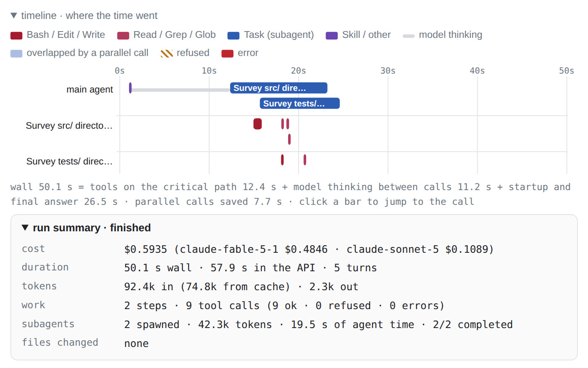
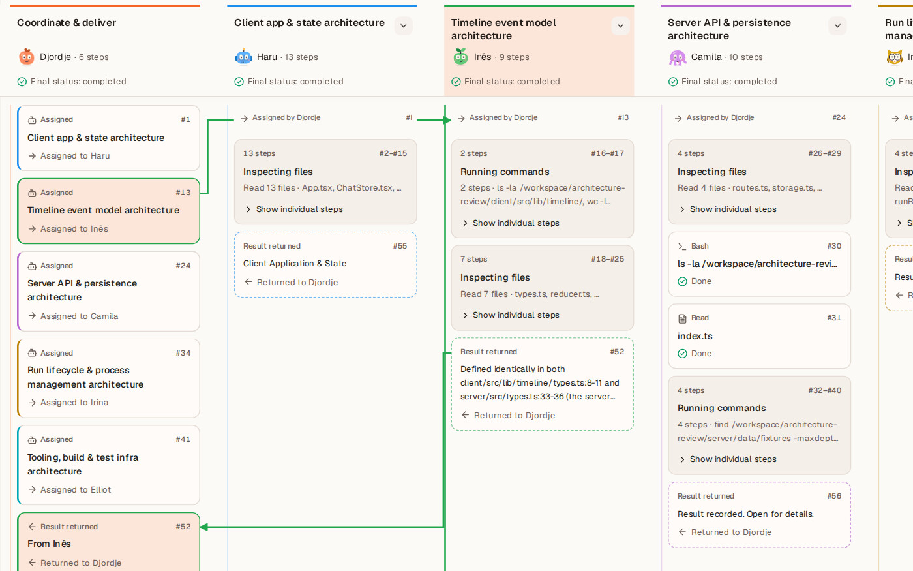
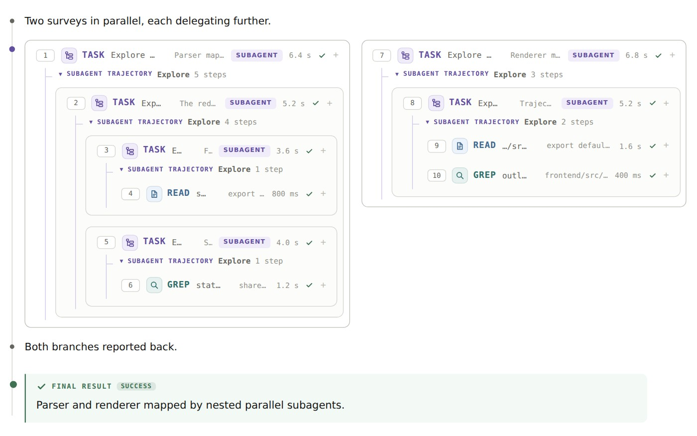
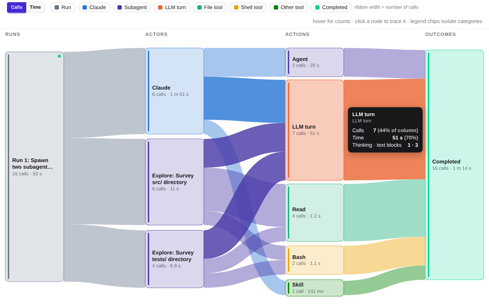
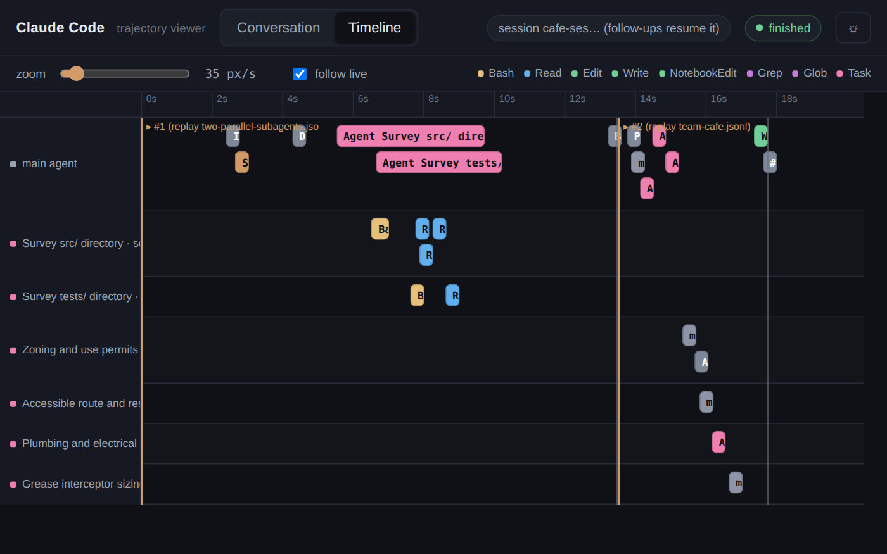
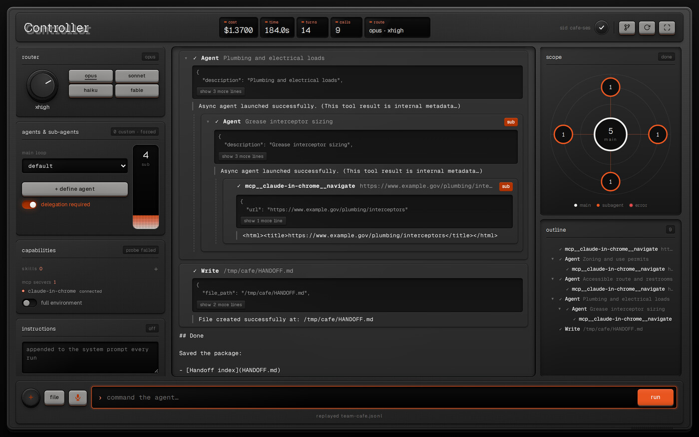

# Mads Lens

Seven small web apps for driving [Claude Code](https://docs.anthropic.com/en/docs/claude-code) and watching it work.

Each app runs `claude -p … --output-format stream-json` against a directory you choose and turns the event
stream into something you can read while it happens: tool calls, subagents working in parallel, failures,
time and cost. They all solve the same problem, but each takes a different idea and builds the whole app
around it.

Every folder is a self-contained app with its own README. Each one bundles recorded runs, so you can try it
without installing Claude Code or spending any usage.

<table>
<tr>
<td width="50%" valign="top">
<a href="intent-timeline/"></a><br>
<b><a href="intent-timeline/">Intent Timeline</a></b>: Steps headed by what the agent said it would do, plus a "where the time went" timeline and cost split by model.<br>
<sub>Python standard library, vanilla JS · Created by Yide Bian</sub>
</td>
<td width="50%" valign="top">
<a href="patchwork/"></a><br>
<b><a href="patchwork/">Patchwork</a></b>: Delegation as a team at work: named subagents, one lane per agent, handoff cards.<br>
<sub>Vite + React, Express · Created by Djordje Ivanovic</sub>
</td>
</tr>
<tr>
<td width="50%" valign="top">
<a href="fork-view/"></a><br>
<b><a href="fork-view/">Fork View</a></b>: Parallel work forks the log into side-by-side columns, nested recursively.<br>
<sub>Vite + React, Express · Created by Zoe Jingyi Liu</sub>
</td>
<td width="50%" valign="top">
<a href="sankey-flow/"></a><br>
<b><a href="sankey-flow/">Sankey Flow</a></b>: A Sankey of where a run's calls and time went (agent → tool → outcome), plus speed gauges and an animated cat.<br>
<sub>Python + Flask · Created by Ibrahim Khaliliya</sub>
</td>
</tr>
<tr>
<td width="50%" valign="top">
<a href="swimlanes/"></a><br>
<b><a href="swimlanes/">Swimlanes</a></b>: A real time axis: one swimlane per agent, with zoom and follow-live.<br>
<sub>Python standard library, single file · Created by Eric Gong</sub>
</td>
<td width="50%" valign="top">
<a href="controller/"></a><br>
<b><a href="controller/">Controller</a></b>: A hardware-style control surface (effort knob, model keys, subagent fader) with a radial scope of agents.<br>
<sub>Node + TypeScript, no dependencies · Created by Raul Romero</sub>
</td>
</tr>
<tr>
<td colspan="2" align="center" valign="top">
<a href="mission-control/"></a><br>
<b><a href="mission-control/">Mission Control</a></b>: Sessions you manage, with a card per delegated subagent, a view scoped to each one and a call inspector.<br>
<sub>Next.js + tRPC + SQLite · Created by Saul Richardson</sub>
</td>
</tr>
</table>

## Getting started

```bash
git clone https://github.com/HarvardMadSys/CS2680-Assignment1-Mads-Lens.git
cd CS2680-Assignment1-Mads-Lens/<app>
```

Then follow that app's README. Every app serves on **port 8000** and listens on all interfaces (`0.0.0.0`), so
you can open it at http://localhost:8000 or, from another machine, at `http://<your-machine-ip>:8000`. Set
`PORT` (and `HOST`) to change this.

Because they share a port, run one app at a time.

**Requirements:** Node.js 22 and Python 3.9+ cover every app (individual READMEs list exact versions). Live
mode also needs the `claude` CLI, installed and logged in.

## Before you use live mode

- **Point the app at a scratch directory.** Several of these apps run Claude Code with permission prompts
  turned off (`--dangerously-skip-permissions` or `bypassPermissions`). The agent can then edit files and run
  commands in that directory without asking.
- **Mind the network.** The apps listen on `0.0.0.0`, so anyone who can reach port 8000 on your machine can use
  them. In live mode, that means they can run Claude Code on your machine with your account. On a network you
  don't trust, start the app with `HOST=127.0.0.1`.
- Live runs use your Claude usage. The bundled replays don't.

## Credits

These apps were built by students in Harvard's CS 2680 (Modern AI Systems) in Fall 2026, and were chosen from
the class's projects for their designs. Each app's README names its author.
