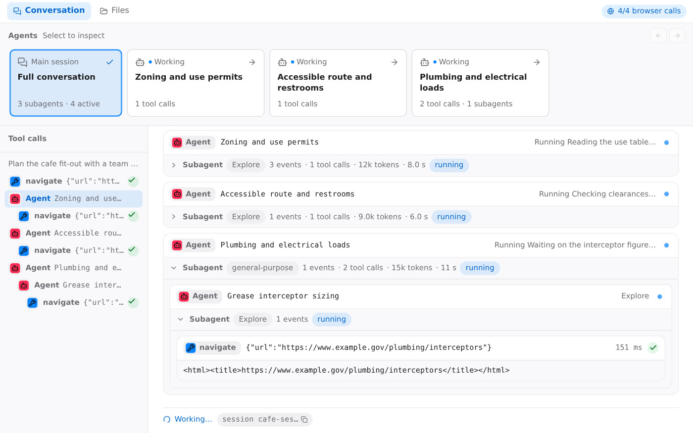

# Mads Lens: CS 2680 Assignment 1

A showcase of student work from **Assignment 1** in Harvard's **CS 2680: Modern AI Systems**, Fall 2026.

This collection brings together seven student-built web interfaces for running Claude Code and
understanding its work: the tools it calls, the tasks it delegates, and the time and cost of a run.
Each project takes a different approach to making that activity easier to follow.

The creative ideas are a highlight. A conversation can fork into parallel columns, delegated agents
can become a cast of teammates, and model settings can become knobs and faders on a control board.
Together, these projects show the range of interfaces students imagined around the same agent workflow.

## Student projects

Explore the screenshots below, then open a project for its setup instructions and design details.
Every app includes recorded runs or a demo mode, so you can try it without installing Claude Code
or consuming Claude usage.

<table>
<tr>
<td width="50%" valign="top">
<a href="intent-timeline/"></a><br>
<b><a href="intent-timeline/">Intent Timeline</a></b>: Organizes activity around what the agent said it would do, then shows where the time and money went with per-agent timelines and cost breakdowns.<br>
<sub>Python standard library, vanilla JS · Created by Yide Bian</sub>
</td>
<td width="50%" valign="top">
<a href="patchwork/"></a><br>
<b><a href="patchwork/">Patchwork</a></b>: Turns delegation into a team at work: named characters, a lane for each agent, and handoff cards showing what was assigned and what came back.<br>
<sub>Vite + React, Express · Created by Djordje Ivanovic</sub>
</td>
</tr>
<tr>
<td width="50%" valign="top">
<a href="fork-view/"></a><br>
<b><a href="fork-view/">Fork View</a></b>: Makes parallelism part of the layout: the log splits into side-by-side columns when agents work concurrently, with further forks for nested delegation.<br>
<sub>Vite + React, Express · Created by Zoe Jingyi Liu</sub>
</td>
<td width="50%" valign="top">
<a href="sankey-flow/"></a><br>
<b><a href="sankey-flow/">Sankey Flow</a></b>: Maps calls and time as flows between runs, agents, actions and outcomes. Live speed gauges and a cat whose animation follows the token rate add a playful touch.<br>
<sub>Python + Flask · Created by Ibrahim Khaliliya</sub>
</td>
</tr>
<tr>
<td width="50%" valign="top">
<a href="swimlanes/"></a><br>
<b><a href="swimlanes/">Swimlanes</a></b>: Places each agent on a shared time axis, making overlapping tool calls and parallel work visible at a glance, with zoom and live following.<br>
<sub>Python standard library, single file · Created by Eric Gong</sub>
</td>
<td width="50%" valign="top">
<a href="controller/"></a><br>
<b><a href="controller/">Controller</a></b>: Reimagines agent controls as music hardware: an effort knob, model keys and a subagent fader, alongside a radial display of the agents at work.<br>
<sub>Node + TypeScript, no runtime dependencies · Created by Raul Romero</sub>
</td>
</tr>
<tr>
<td colspan="2" align="center" valign="top">
<a href="subagents-as-a-team/"></a><br>
<b><a href="subagents-as-a-team/">Subagents as a team</a></b>: Makes each subagent easy to inspect: its card opens a focused view of its task, activity and result, with a call inspector for the details.<br>
<sub>Next.js + tRPC + SQLite · Created by Saul Richardson</sub>
</td>
</tr>
</table>

## Try a project

Clone the collection:

```bash
git clone https://github.com/HarvardMadSys/CS2680-Assignment1-Mads-Lens.git
cd CS2680-Assignment1-Mads-Lens
```

Choose a project from the gallery and follow its README. Each app is self-contained, with its own
setup instructions and replay or demo walkthrough. Start with a bundled recording to explore the
interface and see its approach to subagents, tool calls and parallel work.

Or start any app with one command:

```bash
cd <app>
./start.sh
```

`start.sh` checks the app's requirements, installs its dependencies on the first run (and again only when
they change), and starts it the way its README does. In Sankey Flow and Subagents as a team,
`./start.sh --demo` starts with the bundled recordings instead of Claude.

The projects use Python or Node.js; check the chosen app's README for the required version and
package manager. Live mode also requires the `claude` CLI to be installed and logged in.

All apps use **port 8000** by default. Open [localhost:8000](http://localhost:8000) after starting one.
Run one app at a time, or change its `PORT` setting; apps with a separate API server may also need
a different `API_PORT`.

## Using live mode

These are student assignment projects. Before connecting one to a live agent, read its README for
its permission settings and behavior.

- **Use a disposable working directory.** Several apps bypass permission prompts, allowing Claude
  Code to edit files and run commands with your account's privileges. The working directory is not
  a sandbox.
- **Check network access.** The apps listen on all interfaces (`0.0.0.0`) by default. Anyone who can
  reach the app may be able to start live runs on your machine. Set `HOST=127.0.0.1` to restrict
  access to your machine.
- **Live runs consume Claude usage.** Bundled replays and demo mode do not.
