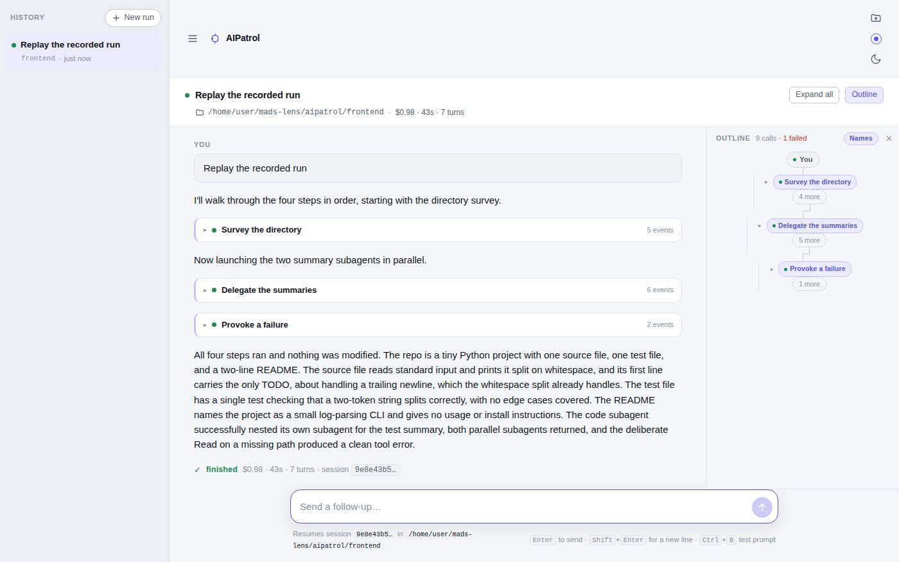

# AIPatrol

A web page for driving Claude Code and watching it work. The agent announces its tasks, and both the transcript and the outline group its tool calls under them.



Created by Alexander Aghili.

## What it does

You type a request. The server runs `claude -p` in a working directory you choose and streams its events to the page, which draws the run as it happens.

- **Tasks the agent announces.** Every run gets a short extra system prompt ([`frontend/server/agent-prompt.md`](frontend/server/agent-prompt.md)). It asks Claude to wrap each unit of work in `[[task-start <title>]]` … `[[task-end]]` lines. The page removes those markers and turns them into named, nestable task blocks. Each block is a single row with a status dot and an event count until you open it, so a 30-call run reads as a handful of named steps. If the agent skips the markers, the run simply renders flat.
- **An outline drawn as a flow graph.** A side panel shows the whole run, round by round. Tasks open lanes. Parallel subagents fork into labelled lanes and merge back when the main agent carries on. Each pill has a status dot: green for done, blue for running, red for failed. The header keeps a count such as `9 calls · 1 failed`. Click a pill to jump to that call. The **Names / Tools** switch labels delegations either by what they were asked to do or by their bare tool name. Lanes fold to an "N more" stub. The panel can be resized and hidden.
- **Subagents nest.** A subagent's events sit under the `Agent` call that launched it, to any depth, including a subagent inside a subagent.
- **Long results are cut to size.** Results keep their first *and* last lines around a "⋯ N more lines — show all" bar, so a pytest summary at the end of a long log stays visible. Each tool gets its own line budget, and failed calls get more room.
- **Conversations.** A follow-up resumes the same session (`--resume`). Each round ends with its own `✓ finished $0.98 · 43s · 7 turns` line, and the run header adds up every round. Earlier rounds fold down to their conclusion.
- **Several runs at once.** The History sidebar lists your runs. Runs keep going in the background, each one has a Stop button, and the composer will not send a follow-up while that run is still going.
- **Replay.** Stream a recorded `--output-format stream-json` file instead of running the agent, either from the server or by opening a `.jsonl` file in the browser.
- **Extras.** **Ctrl+B** loads (but does not send) a test prompt that exercises every shape the page draws. There is a light/dark toggle and five colour schemes.

## Requirements

- Node.js 22.13 or newer, with npm (tested with Node 22.22).
- For live mode only: the [Claude Code](https://docs.claude.com/en/docs/claude-code) CLI (`claude`), installed and logged in. Replay needs neither `claude` nor an account.
- Optional: Python 3 and `pytest`, if you want to run the bundled demo project's tests yourself.

## Quick start

```bash
cd aipatrol/frontend
npm ci
npm run dev
```

Open http://localhost:8000 (or http://<your-machine-ip>:8000 from another machine).

The run API is mounted inside Vite's dev server, so this one process serves both the page and the API.

## Try it without Claude (replay)

Nothing below starts Claude Code or spends any usage.

**Option A: replay mode on the server.**

```bash
cd aipatrol/frontend
npm run replay
```

Open http://localhost:8000, type any prompt and press Enter. In this mode the server never starts an agent. Each prompt streams the next recording instead: first `fixtures/everything.jsonl`, then `fixtures/subagents-recombine.jsonl`, then back to the first. Nothing happens until you send a prompt.

You can choose your own recordings with `REPLAY` (one file, or several separated by commas):

```bash
REPLAY=fixtures/tasks.jsonl,fixtures/with-failure.jsonl npm run dev
```

The equivalent command-line flag needs a second `--`, because Vite rejects `--replay` as an unknown option: `npm run dev -- -- --replay=fixtures/everything.jsonl`.

**Option B: open a recording in the browser.** Start the page with `npm run dev` or `npm run replay`. Click the folder icon at the top right (**Open a recorded run**) and pick any file from `frontend/fixtures/`. The file is parsed in your browser and replayed through the same code a live run uses. Such a run is badged *recording* and cannot be continued.

Bundled recordings, all captured from real runs:

| File | What it shows |
| --- | --- |
| `everything.jsonl` | Nested tasks, two parallel subagents, a subagent inside a subagent, and a failed `Read` |
| `subagents-recombine.jsonl` | Two subagents whose lanes merge back into the main trajectory |
| `two-subagents.jsonl` | Two subagents where the fork ends the run |
| `tasks.jsonl` | A task containing a delegation |
| `with-failure.jsonl` | A real `is_error: true` result beside a successful one |
| `demo-fix.jsonl` | The agent finding and fixing the demo project's failing test |

## Things to try

1. Run `npm run replay` and send any prompt. The agent's announced tasks appear one by one as rows with a live event count. Each dot is blue while its task runs and turns green when it is done. Click a row to open it.
2. Click **Expand all** and read the outline. You will see tasks as lanes, a delegation forking into two subagents, a subagent inside a subagent, and a red failed `Read`. The header reads `9 calls · 1 failed`. Click the red pill to jump to the failed call.
3. Toggle **Names / Tools** in the outline header.
4. Send a follow-up in the same run. The second recording plays as round 2, its two subagent lanes merge back, and the run header adds up both rounds.
5. Use the folder icon to open `fixtures/subagents-recombine.jsonl` as a separate run, then switch between runs in the History sidebar.
6. Try the theme and colour-scheme buttons at the top right.

## Live mode with Claude Code

1. Install Claude Code and log in (`claude` should work in your terminal). Leave `ANTHROPIC_API_KEY` unset unless you mean to use it. The server passes its environment through to `claude`, and an exported key takes precedence over your login.
2. Create the disposable demo workspace. Runs default to it:

   ```bash
   cd aipatrol/frontend
   npm run demo:reset
   ```

   This copies `demo/pristine/` (`logtool`, a small Python log summariser with one failing test planted on purpose) to `demo/workspace/`. That folder is git-ignored. Run the command again whenever you want the bug back. See [`demo/README.md`](demo/README.md) for prompts that demo well.
3. Start the page with `npm run dev` and send a prompt.

To work somewhere else, click the directory shown under the prompt box and type a path (`~` works). You can also start the server with `DEFAULT_CWD=/path/to/scratch`. A run keeps the directory it started in, and follow-ups reuse it.

**Permissions.** By default, every run is started with `--dangerously-skip-permissions`. Claude can then edit files and run any shell command in that directory without asking. Only point it at a directory you are happy to lose. To approve only specific tools instead, set `ALLOWED_TOOLS`, e.g. `ALLOWED_TOOLS="Read Edit Bash(pytest:*)" npm run dev`. That passes `--allowedTools`, and anything else is refused.

Things to know:

- If `demo/workspace/` does not exist, runs default to the directory the server was started in, which is `frontend/` itself. Run `npm run demo:reset` first.
- With plain `npm run dev`, typing a prompt while a recording is open starts a new **live** run (the hint under the prompt box says so). Use `npm run replay` or `REPLAY=` if you want to be sure no agent can start.
- Run history lives in the browser tab. Reloading the page abandons in-flight runs, and the server stops their `claude` processes.
- Under `npm run dev`, task blocks, subagent blocks and outline lanes start folded. In the production build (`npm run start`), small ones start open.

## Configuration

| Variable | Default | Effect |
| --- | --- | --- |
| `PORT` | `8000` | Port to listen on |
| `HOST` | `0.0.0.0` | Interface to bind; use `127.0.0.1` for this machine only |
| `ALLOWED_HOSTS` | (none) | Extra hostnames the dev server accepts, comma-separated (localhost and IP addresses always work) |
| `REPLAY` | (none) | Recordings to stream instead of running Claude, comma-separated |
| `DEFAULT_CWD` | `demo/workspace` if it exists, else the server's directory | Working directory offered for new runs |
| `ALLOWED_TOOLS` | (none) | Space-separated tools to auto-approve instead of `--dangerously-skip-permissions` |
| `CLAUDE_BIN` | `claude` | Path to the Claude Code CLI |
| `TASKS` | `on` | `off` stops adding the task-marker system prompt |

Example: `HOST=127.0.0.1 PORT=8200 npm run dev`.

To serve a production build from plain Node, without Vite: `npm run start` builds into `frontend/dist/` and serves the page and API on the same port, with the same variables.

## Security note

The server listens on `0.0.0.0` by default, so anyone who can reach port 8000 can use it. In live mode that means they can run Claude Code on your machine with permission prompts turned off. On a network you do not trust, start it with `HOST=127.0.0.1`. The run endpoint refuses cross-origin browser requests, so other web pages you visit cannot start a run. It does no other authentication.

## Development

```bash
cd aipatrol/frontend
npm run check     # oxlint, tsc, and the vitest suite
```

The tests never start a real agent. Server tests point `CLAUDE_BIN` at a fake CLI (`tests/fixtures/fake-claude.mjs`), and `tests/unit/fixtures.test.ts` runs the bundled recordings through the real parser and checks the tree that comes out.

[`frontend/README.md`](frontend/README.md) explains how the app works: how a run flows from the composer to the subprocess and back, how events become a tree, how tasks are reconstructed, and why each display decision went the way it did.

```
aipatrol/
  frontend/
    src/              React + TypeScript page
    server/           run API (spawns `claude -p`, streams NDJSON), replay, agent prompt
    fixtures/         recorded runs for replay
    tests/            vitest: unit, DOM and server tests
    scripts/          demo-reset.mjs
    tools/            headless-Chrome screenshot helpers used during development
  demo/
    pristine/         the demo project, never edited
    workspace/        disposable copy the agent works in (created by npm run demo:reset)
```
