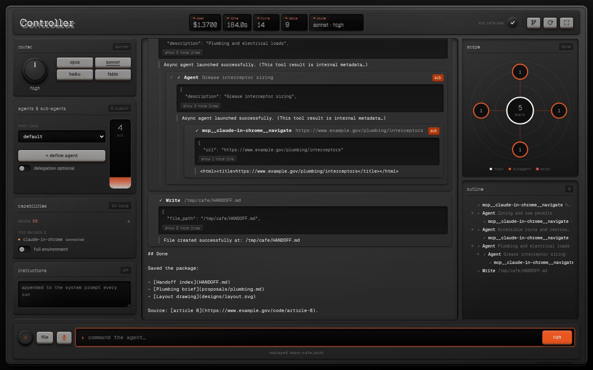

# Controller

An **Assignment 1** project by **Raul Romero** for **Harvard CS 2680: Modern AI Systems (Fall 2026)**.

Controller imagines an agent interface as a piece of music hardware. An effort knob, model keys and a
subagent fader make Claude Code's settings into controls you can manipulate, while a radial scope
shows the main agent and its collaborators at work. The project brings configuration and observation
together on one board.



## Design and features

The board keeps its controls in place between runs. A streaming transcript occupies the centre, with
a scope and outline for following the work across agents. The hardware styling extends from the
knob and fader to LCD-style readouts for cost, time, turns, calls and the selected route.

### Shape the run

- **Effort knob and model keys.** Drag, scroll or use the arrow keys to select
  `low · medium · high · xhigh · max`, then choose `opus`, `sonnet`, `haiku` or `fable`.
  These set `--effort` and `--model`; the top bar's `route` readout shows the selected pair.
- **Subagent fader.** The LED fader ranges from 0 to 25 and passes the concurrency setting to Claude as
  `CLAUDE_CODE_MAX_CONCURRENT_SUBAGENTS`. At 0, the `Agent` and `Task` tools are withheld entirely.
- **Delegation switch.** **Delegation required** selects a generated `orchestrator` agent whose tools
  are limited to `Agent`, `Task`, `Read`, `Glob`, `Grep` and `TodoWrite`. It cannot edit files or run
  commands itself, and its prompt asks it to divide the work into as many pieces as the fader specifies.
  **Optional** leaves delegation to the model. The required setting relies on this agent definition
  and prompt; it is not a hard guarantee that delegation will occur.
- **Custom agents.** Use **+ define agent** to supply a name, description, prompt and tool list. These
  definitions are passed through `--agents`, and the **main loop** selector chooses the session's
  agent with `--agent`.
- **Capabilities.** The board probes local Claude Code for its tools, skills and MCP servers. Clicking
  a skill chip inserts `/skill-name` into the prompt. A search of the [skills.sh](https://skills.sh)
  registry shows install counts and an **add** button. MCP servers are isolated with
  `--strict-mcp-config` unless **full environment** is enabled.
- **Instructions.** Text entered here is appended to the system prompt on each run.
- **Version control.** **diff** and **commit** insert prepared prompts into the command bar for you to
  run. The branch icon at the top right opens a merge panel; its behavior is described under
  [Live mode](#live-mode-with-claude-code).

### Follow the work

- **Trajectory cards.** Each tool call has JSON input, a result with line numbers, a `✓` or `✕` status,
  and folds such as **show 30 more lines**. Failed calls have red outlines. Subagent calls carry a
  `sub` badge and nest inside the `Agent` card that started them.
- **Radial scope.** The main agent is the hub, with a satellite for each subagent. Nodes show completed
  call counts and progress rings. Dashed, pulsing links indicate busy subagents; a node turns red when
  one of its calls fails.
- **Outline.** A foldable call tree preserves the agent nesting. Click any row to jump to its card.
- **Follow-ups during a turn.** Messages sent while Claude is working join the running session.
  Pressing **run** with an empty prompt stops the current turn. **Continue session** uses `--resume`;
  the circular-arrow button at the top right starts a fresh session.
- **Other inputs and shortcuts.** **file** attaches text files as context. The mic uses the Web Speech
  API for dictation in supported browsers. Press `F` for full screen, or `C` / `S` to show the
  controls / scope on narrow screens.
- **Recording and replay.** Live runs are saved to `runs/<timestamp>.jsonl`. Replays feed those events
  back into the board without running the recorded prompt through Claude.

## Requirements

- **Node.js 22.18 or newer.** Node runs the TypeScript server directly, without a build step. On
  Node 22.6–22.17, use `node --experimental-strip-types src/server.ts` instead of `npm run serve`.
- npm. There are no runtime dependencies; `npm install` fetches TypeScript and Node types for
  `npm run typecheck`.
- **For live mode only:** the [Claude Code](https://docs.anthropic.com/en/docs/claude-code) CLI
  (`claude`), on your `PATH` and logged in.
- Optional: network access for skills.sh search, and `git` for the merge panel.

## Quick start

From the collection's root directory:

```bash
cd controller
npm install
npm run serve
```

Open [localhost:8000](http://localhost:8000), or `http://<your-machine-ip>:8000` from another machine.

## Try the bundled replays without Claude

Two recordings are included in `demo-runs/`:

1. Start the server with `npm run serve`.
2. Open [the subagent recording with a delay](http://localhost:8000/?replay=subagent-forward.jsonl&delay=80)
   to watch its events stream into the board.
3. Try [the team recording](http://localhost:8000/?replay=team-cafe.jsonl) for a session with four
   subagents, including nested delegation.

Replay options and behavior:

- `replay=<file>.jsonl` looks for the file in `runs/` first, then `demo-runs/`.
- `delay=<ms>` pauses between lines. Omit it to load the entire recording at once.
- There is no in-app picker. To replay your own recording, use its file name from `runs/` in the URL.
- Without `claude`, the capabilities module reports **probe failed**. This is expected; the other
  replay features still work. If Claude is installed, the capabilities probe can run even when you
  open a replay; see [Live mode](#live-mode-with-claude-code).
- For a terminal view of the same call tree, use
  `npm run replay -- demo-runs/team-cafe.jsonl`.

The `team-cafe.jsonl` fixture is a synthetic team scenario. The demo files include paths from
other machines.

## Explore the design

- **Watch delegation appear.** Open `?replay=subagent-forward.jsonl&delay=80`. An `Agent` card arrives
  first, followed by nested `Bash` and `Read` calls with `sub` badges. The subagent's scope satellite
  counts up to 11 completed calls beside the main hub's 6.
- **Inspect a team.** Open `?replay=team-cafe.jsonl` to see four satellites around the main agent.
  One subagent was started by another subagent; the outline preserves that relationship.
- **Try the physical controls.** Drag the effort knob up or down, scroll on it, or focus it and use
  the arrow keys. Watch the `route` readout as you change effort or press a model key. Drag or scroll
  the subagent fader: at 0, the delegation switch reads **delegation off**. Raise it to explore
  **delegation required**.
- **Browse skills.** In **capabilities**, expand the **skills** row with **+** and search for
  `frontend design` to see registry results and install counts. This needs network access. The
  **add** button installs a skill; searching does not require pressing it.
- **Navigate the transcript.** Click outline rows to jump to cards, fold subagent groups, and use `F`
  to switch to full screen.

## Live mode with Claude Code

1. Install the `claude` CLI and log in.
2. Start the server with `npm run serve` and open the page.
3. Press **+** at the bottom left to open run settings: working dir, `--add-dir`, **bypass perms** and
   **continue session**.
4. Enter a prompt in the command bar and press **run**.

### Working directory and permissions

The default working directory is `sandbox/` inside this project. It is git-ignored and created on the
first run. Put a scratch copy of a project there, or select another scratch directory.

**Bypass perms is on by default.** This adds `--dangerously-skip-permissions`, approving every tool
call without asking. Claude can edit or delete files and run shell commands as your user, including
outside the selected directory. The default `sandbox/` is a folder inside this repository clone, not
an isolated environment. Use a scratch directory, ideally in a container or VM.

Turning bypass perms off selects `--permission-mode acceptEdits`: file edits are auto-approved, but
other tools that require approval are not.

### How a live run starts

The base command is:

```
claude -p --input-format stream-json --output-format stream-json --verbose --replay-user-messages --strict-mcp-config --forward-subagent-text --model <key>
```

The board supplies `--effort`, `--agent`, `--agents`, `--append-system-prompt`, `--add-dir`, `--resume`
and the permission flag according to its settings. Enabling **full environment** changes the MCP
isolation setting described above. Prompts travel over stdin, which also lets follow-ups join a
running turn. Each run is recorded to `runs/<timestamp>.jsonl`.

**Capabilities probe.** Every page load and every change to **full environment** briefly starts
`claude -p` in the directory from which the server was started. The probe reads the available tools,
skills and MCP servers, then kills the process when its `init` event arrives. This is intended to
happen before a model request.

### Merge and skill installation controls

**Merge panel.** The branch icon at the top right finds the git repository containing the working
directory and previews its branch and commits ahead of `main`. Pressing **merge** checks out `main`,
runs `git merge --no-ff <branch>`, and **pushes `main` to the first remote**.

Controller refuses to merge in the repository that contains Controller itself; the default
`sandbox/` resolves to that repository. To use the panel, select a separate repository, either
another project or `sandbox/` after running `git init` inside it. The merge action includes a push.

**Skills add.** The **add** button runs
`npx -y skills@latest add <owner/repo> --project --yes` in the Controller folder. It downloads
third-party skill files from GitHub into this project, for example under `.claude/skills/`. Those
paths are git-ignored here.

### Terminal driver

`npm run drive -- --help` lists options for a headless driver that runs one prompt and prints the call
tree. Its default is `--permission-mode acceptEdits`. With `--skip-permissions`, it uses `sandbox/`
unless you also supply `--cwd`.

### Try a prompt with subagents

This prompt asks for several agents to work on the selected repository:

```
Spawn subagents to explore the repo and report the most creative features
```

Any existing working directory is accepted. To give the agents six apps to compare, create a
throwaway clone of this collection separate from the checkout running Controller:

```bash
git clone --depth 1 https://github.com/HarvardMadSys/CS2680-Assignment1-Mads-Lens.git ~/scratch/mads-lens
```

Press **+** and set **working dir** to the clone's full path, as printed by `echo ~/scratch/mads-lens`.
The server does not expand `~`. If you have already run a prompt on this page, press the circular-arrow
button first to start a new session rather than resume the previous one.

Keep the subagent fader above 0; it starts at 4. No further enabling is needed with bypass perms on
or off. The server passes no `--allowedTools` or `--tools` list and no turn or budget cap, so `Agent`
(`Task` in older Claude Code versions) is available. **Delegation optional** is sufficient for this
prompt. To request seven agents at once, set the fader to 7 and switch to **delegation required**.

As the run proceeds, each subagent receives a scope satellite with a finished-call count and a
dashed, pulsing link while busy. Its transcript cards arrive with `sub` badges inside the parent
`Agent` card. The outline mirrors that nesting, letting you fold each subagent's activity away.

## Configuration

| Variable | Default | Meaning |
| --- | --- | --- |
| `PORT` | `8000` | Port to listen on |
| `HOST` | `0.0.0.0` | Interface to bind; `127.0.0.1` accepts local connections only |

For example, `HOST=127.0.0.1 PORT=9000 npm run serve` starts a local server on port 9000.

Other settings are on the board. Paths are relative to this folder: `runs/` stores live recordings,
`demo-runs/` contains the bundled recordings, and `sandbox/` is the default working directory.

## Security note

The server listens on `0.0.0.0` by default and has no authentication. Anyone who can reach port 8000
can use it, including running Claude Code with permission checks bypassed by default and invoking
the merge-and-push or skill-install endpoints. On an untrusted network, start it with
`HOST=127.0.0.1 npm run serve`.

## Project layout

```
src/server.ts     HTTP server: static files, run stream, follow-ups, replay, capabilities probe,
                  skills search/install, git merge
src/runner.ts     spawns `claude -p` and yields its stream-json events
src/cli.ts        terminal driver (npm run drive)
src/replay.ts     prints a recording as a call tree (npm run replay)
src/tree.ts       call-tree builder used by the terminal tools
src/types.ts      stream-json event types
public/           the board: index.html, app.js, style.css, Geist fonts
demo-runs/        two bundled recordings for replay
design/           Blender study the interface's look and palette were taken from
```

Run `npm run typecheck` to check the TypeScript.

## Known limitations

- Final answers appear as plain text; Markdown is not rendered.
- Time and turns come from the latest `result` event. In a long session, they can describe only the
  last turn while the call count covers the whole session.
- **Delegation required** depends on the orchestrator definition and prompt, without a hard
  guarantee. **Optional** still permits the model to delegate.
- The scope says **done** when the main turn finishes, even if a background subagent is still
  streaming calls.
- Replay selection uses a URL; there is no in-app recording picker.

[Back to the Assignment 1 showcase](../README.md)
