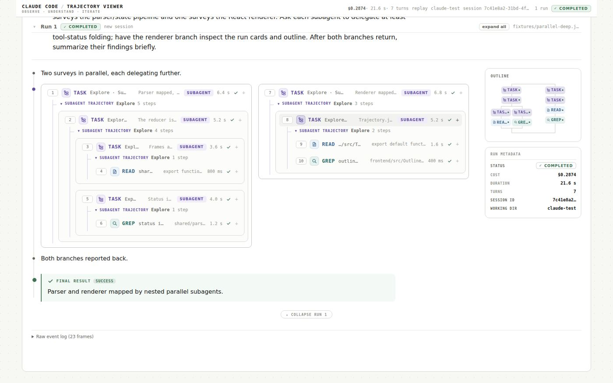

# Fork View

A Claude Code trajectory viewer where parallel work forks the log itself into side-by-side columns.



Created by Zoe Jingyi Liu.

## What it does

Fork View runs Claude Code from the browser (or replays a saved run) and shows the trajectory as a
numbered, readable log with a forking outline next to it. Live and replayed runs go through the same
parser, so a recording looks exactly like the run did.

- **The log forks.** Parallel subagents appear as side-by-side columns inside the trajectory, not
  only in the outline. Each column shows the subagent's task brief, how many steps it took and how
  long, plus its own numbered calls. Nesting is recursive: a subagent that delegates further forks
  again inside its own column.
- **Forking outline.** The right rail draws the run as small pills (`TASK`, `READ`, `BASH`, ...). It
  splits into columns for parallel branches and joins back up afterwards. Click a pill to scroll to
  that call and highlight it. Hover it to see its number, type, description and status.
- **Careful cost accounting.** While a run streams, the header shows a `≥$` lower bound priced from
  the token usage seen so far. When the result arrives it is replaced by the exact cost. Subagent
  branches show their own token-priced `≥$` estimate. Hidden thinking is shown as an estimated token
  count (`thinking · ~247 tokens`).
- **Tool rows that tell the story while collapsed.** Each row has a run-wide sequence number, a
  tool icon, the argument, a one-line result preview, the duration and a status mark. Expand a row
  to see COMMAND / INPUT / OUTPUT / ERROR blocks, with "Show all (N more lines)" for long output.
- **Explicit end states.** A failed run says "no result event — metrics unavailable for this run".
  A stopped run marks pending calls "no result arrived before the run ended" and adds "Run stopped.
  Everything recorded before this point is kept."
- **Conversations.** You can send follow-ups in the same session (`--resume`), or use the
  **Continue from** picker (date, time and prompt preview) to pick up an earlier session. There is
  also a runs list, collapsible runs, expand all / collapse all, a **Stop** button and a
  "↓ Jump to latest" pill.
- **Attachments.** Drag and drop or paste images (png, jpg, gif, webp) and PDFs up to 20 MB. They
  are saved under `.uploads/` in the run's working directory, and the prompt tells Claude to read
  them.
- **Provenance.** Every run shows where it was recorded (`sessions/runs/...`) and whether it started
  a new session or resumed one. A raw event log and a "Show raw JSON on each node" toggle let you see
  the underlying frames.

## Requirements

- Node.js 22.12 or newer, and npm.
- The [Claude Code](https://docs.claude.com/en/docs/claude-code) CLI (`claude`), installed and logged
  in. You only need it for live runs; replay works without it.

## Quick start

```bash
cd fork-view
npm ci
npm run dev
```

Open http://localhost:8000 (or `http://<your-machine-ip>:8000` from another machine).

`npm run dev` starts the Vite dev server on port 8000 and the API server on an internal port (8001,
loopback only). Vite proxies `/api`, including the live event streams, so the browser only needs
port 8000.

To run a single production process instead (the API server also serves the built UI on port 8000):

```bash
npm run build
npm start
```

## Try it without Claude (replay)

The `fixtures/` and `claude-test/` folders contain recorded trajectories. Replays render instantly
and never start Claude Code.

1. Start the app (`npm run dev`) and open http://localhost:8000.
2. In the **Replay** panel at the bottom of the page, choose `fixtures/parallel-deep.jsonl` under
   **Saved trajectory**.
3. Click **Replay**.

The list holds every `.jsonl` file in `fixtures/`, `claude-test/` and (once you have made live runs)
`sessions/runs/`. A replayed run cannot be continued with a follow-up, so click **New conversation**
before typing a prompt.

## Things to try

- **Nested parallel subagents.** Replay `fixtures/parallel-deep.jsonl`. Two subagents run side by side
  as columns, and the left one forks again into two more columns inside itself. The outline forks
  twice to match. (This fixture was put together to show the layout. It is not a real trace.)
- **Outline navigation.** Click a pill in the outline to jump to that call. The row gets a highlight
  box.
- **Cost of a subagent.** Replay `fixtures/subagent-forward.jsonl`. The subagent's branch header
  shows a token-priced `≥$` estimate, and RUN METADATA shows the run's exact cost.
- **Long output.** Replay `fixtures/long-output.jsonl` and expand a tool row to see the folded output
  and "Show all (N more lines)".
- **A plain real run.** Replay `claude-test/events.jsonl`, then use **expand all**, open the
  **Raw event log** at the bottom of the run, or tick **Show raw JSON on each node**.

## Live mode with Claude Code

1. Make sure `claude` is on your `PATH` and logged in (or set `CLAUDE_BIN`, see below).
2. Under **New conversation**, set **Working directory** and type a prompt, then click **Run**.
3. While it runs, watch the header's `≥$` meter, the sticky "currently running" line and the
   forking outline. Press **Stop** to end the run early.
4. When the run finishes, type another prompt to send a follow-up in the same session. You can also
   use **Continue from** to resume an earlier conversation, or **New conversation** to start fresh.

**About the working directory:**

- It is relative to the project folder and must stay inside it. `node_modules`, `sessions` and
  `.git` are refused.
- The default is `claude-test/`, a tiny sample project (`main.py`).
- For experiments, use a throwaway folder that git ignores, for example `mkdir -p runs/scratch`, and
  then enter `runs/scratch` as the working directory.

**What gets run.** Each run starts:

```
claude -p --output-format stream-json --verbose --dangerously-skip-permissions --forward-subagent-text [--resume <session-id>]
```

The prompt is sent on stdin. **`--dangerously-skip-permissions` means Claude Code will not ask before
editing files or running shell commands.** The working-directory check only decides where Claude Code
starts. It does not sandbox it, so Claude can still reach anything your user account can. Only run
prompts you would be comfortable running unattended.

Each live run is recorded to `sessions/runs/<timestamp>.jsonl` with a `.meta.json` sidecar (and a
`.stderr.log` if Claude wrote to stderr). These recordings show up in the Replay list and in
**Continue from**. They are git-ignored.

If `claude` is missing or fails to start, the run is marked FAILED with the error message, and the
rest of the app keeps working.

**Example prompt.** This one makes Claude delegate, so the log has something to fork:

```
Spawn subagents to explore the repo and report the most creative features
```

"The repo" is the working directory, which must stay inside the project folder. To give the
subagents eight apps to compare, clone this app collection into the git-ignored `runs/` folder:

```bash
git clone --depth 1 https://github.com/HarvardMadSys/CS2680-Assignment1-Mads-Lens.git runs/mads-lens
```

Enter `runs/mads-lens` as the **Working directory**. If **Continue from** is showing, set it to
**Start a new conversation**, or the run tries to resume your latest session instead. Nothing needs
enabling: the command above restricts no tools and sets no turn or budget cap, so the subagent tool
(`Agent`, or `Task` in older Claude Code versions) is available, and Fork View forks on either name.

Subagents launched in the same turn fork the log into columns (side by side on a wide window), and
the outline forks with them. Branch headers time each subagent live and add a `≥$` estimate when it
reports back. A branch past six steps folds to its header: click it to look inside.

## Configuration

| Variable | Default | Meaning |
| --- | --- | --- |
| `PORT` | `8000` | Port the browser connects to: Vite under `npm run dev`, the Express server under `npm start`. |
| `HOST` | `0.0.0.0` | Interface to listen on. Use `127.0.0.1` to accept local connections only. |
| `API_PORT` | `8001` | `npm run dev` only: the internal API server port. It always listens on `127.0.0.1`. |
| `CLAUDE_BIN` | `claude` | Path or name of the Claude Code executable used for live runs. |

Example: `PORT=8130 API_PORT=8131 HOST=127.0.0.1 npm run dev` serves the app on
http://127.0.0.1:8130 only. Vite does not fall back to another port: if `PORT` is in use, it stops
with "Port ... is already in use".

## Security note

By default the app listens on `0.0.0.0`, so anyone who can reach port 8000 on your machine can use
it. In live mode, that means they can run Claude Code on your machine with
`--dangerously-skip-permissions`, as your user. There is no authentication. On a shared or untrusted
network, start it with `HOST=127.0.0.1`.

## Tests

```bash
npm run check
```

These offline checks cover event parsing, conversation state, the subagent hierarchy, upload
validation and rendering. They need no server and no Claude Code.

`scripts/check-browser.mjs` is a separate end-to-end suite. It drives the built app in a
Chromium-based browser (`CHROME_PATH`, `BASE_URL`) and **performs live Claude Code runs**, so it
needs a logged-in `claude` and uses API credits. `scripts/record-subagent.mjs` is the script that
recorded the `fixtures/subagent-*.jsonl` files, and it also runs Claude Code live.

## Project layout

| Path | Purpose |
| --- | --- |
| `server/` | Express API: starts Claude Code, streams frames over server-sent events, lists and serves trajectories, accepts uploads |
| `frontend/` | React UI (Vite) |
| `shared/` | Code shared by server, UI and checks: event parsing, conversation state, subagent hierarchy, pricing, attachment rules |
| `scripts/` | Dev launcher (`dev.mjs`) and the check suites |
| `fixtures/` | Recorded trajectories used for replay and by the checks |
| `claude-test/` | Default working directory for live runs, plus a sample recorded run (`events.jsonl`) |
| `sessions/runs/` | Recordings of your own live runs (created on first run, git-ignored) |

## Known limitations

- `npm ci` prints an `EBADENGINE` warning on Node older than 22.22.2. It comes from `jsdom`, a
  dev-only dependency used by the checks, and is harmless. The app and `npm run check` work on
  22.22.0.
- The header's live `≥$` meter appears only during live runs. In replay, `≥$` appears on subagent
  branch headers.
- Only subagents fork. Parallel ordinary tool calls (for example two simultaneous web searches) are
  stacked in the outline, not shown side by side.
- Side-by-side subagent columns are narrow, so wide code blocks scroll horizontally.
