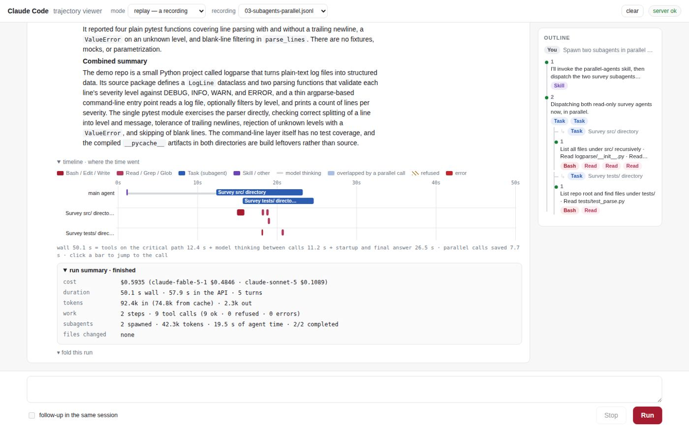

# Intent Timeline

A Claude Code trajectory viewer that explains where the time and money went: every step is headed by what the agent said it would do, and every run ends with a per-agent timeline and a cost breakdown.



Created by Yide Bian.

## What it does

The page starts `claude -p … --output-format stream-json` in a directory you choose, or replays a
recorded run, and draws the event stream as it arrives. Its title bar says **Claude Code
trajectory viewer**. The server is a single Python standard-library file and the page is plain
JavaScript, so there is nothing to install.

- **Steps, not tool cards.** The unit on screen is a *step*: the sentence the agent said about what
  it was about to do ("I'll invoke the parallel-agents skill, then dispatch the two survey
  subagents concurrently."), followed by the tool calls it made for it. Each call is one row: tool
  pill, target, a one-line outcome (`21 lines`, `+1 −1`, pytest's own `1 failed, 3 passed`),
  status and duration. Output is folded to a 4-line preview (the last 6 lines on an error). Click a
  row to see the full input and result and the raw event JSON.
- **Refused is not failed.** Calls that the permission allowlist blocked end in `⊘ refused`, not
  `✕ error`. In the outline they get dashed chips and in the timeline hatched bars, and the run
  summary counts them separately (`13 ok · 5 refused · 0 errors`).
- **Timeline: where the time went.** One lane per agent (the main agent plus one per subagent), a
  bar per tool call, the gaps where the model was thinking, and a sentence that breaks the wall
  time down: `wall 50.1 s = tools on the critical path 12.4 s + model thinking between calls 11.2 s
  + startup and final answer 26.5 s · parallel calls saved 7.7 s`. Click a bar to jump to its call.
- **Run summary.** Cost split by model (`$0.5935 (claude-fable-5-1 $0.4846 · claude-sonnet-5
  $0.1089)`), wall time vs API time, turns, tokens with the cached share, calls by status, files
  changed, and subagent totals (spawned, tokens, agent time, completed).
- **Subagents as a tree.** A `Task` row expands into that subagent's own steps, its task brief and
  its final report. A finished subagent collapses to one line of stats.
- **Outline.** On the right, the steps are listed as numbered intent sentences with tool chips.
  Click one to jump to it.
- **Built for reading while it runs.** A thinking indicator ("thinking for 11 s · ≈850 tokens so far ·
  content not exposed by Claude Code") fills the silent gaps. Older runs fold down to their answer and a
  stats line. The page never drags you to the bottom: scroll up and a `↓ latest · N new` pill
  appears instead.
- **Follow-ups, Stop, partial tokens.** A "follow-up in the same session" checkbox resumes the last
  session with `--resume`. **Stop** ends a live run, which is then marked stopped, not failed. "Stream
  partial tokens" adds `--include-partial-messages`.
- **Nothing lost on reload or restart.** Every run's events are saved on the server and restored
  when the page or the server comes back.

## Requirements

- Python 3.9 or newer (standard library only). Tested with Python 3.11.
- A current desktop browser.
- Live mode only: the Claude Code CLI (`claude`) installed and logged in. Replay works without it.

## Quick start

```bash
cd intent-timeline
python3 proto/server.py
```

Open http://localhost:8000 (or http://<your-machine-ip>:8000 from another machine).

## Try it without Claude (replay)

The `fixtures/` folder holds 11 real recorded runs. A replay goes through the same streaming path
as a live run, at about 7 events per second.

1. In the top bar, set **mode** to *replay — a recording*. The page starts in *live* mode.
2. In the **recording** menu pick `03-subagents-parallel.jsonl`. The prompt box fills with the prompt
   that run was given.
3. Press **Run**. The run streams in for about 10 seconds and ends with the timeline and the run summary.

| Recording | What it shows |
|---|---|
| `01-fix-test.jsonl` | A debugging run: Read/Edit/Bash with 3 refused calls (no prompt was recorded for this one) |
| `02-parallel-reads.jsonl` | Three Read calls issued in one step |
| `03-subagents-parallel.jsonl` | Two Explore subagents running in parallel |
| `04-image-result.jsonl` | A tool result that is an image |
| `05-partial-messages.jsonl` | Recorded with `--include-partial-messages` |
| `06-max-turns-error.jsonl` | A failed run (`--max-turns 1`) |
| `06b-bad-resume.jsonl` | A failure where the whole stream is one `result` line (bad `--resume` id) |
| `07-resume-a.jsonl`, `07-resume-b.jsonl` | A session and its resumed follow-up that adds a `--json` flag; 5 refused calls |
| `09-compact.jsonl`, `09b-compact-resumed.jsonl` | A long read-only run, and a resumed run that hit a context compaction |

Replays are saved like live runs (see [Saved runs](#saved-runs)). Press **clear** for a clean page.

To read a recording event by event in the terminal:

```bash
python3 fixtures/inspect.py fixtures/03-subagents-parallel.jsonl
```

`fixtures/ANALYSIS.md` explains what each recording shows about the stream-json format.

## Things to try

- Replay `03-subagents-parallel.jsonl` and scroll down to **timeline · where the time went**. You see
  three lanes (the main agent, "Survey src/ directory", "Survey tests/ directory") and the
  sentence ending "parallel calls saved 7.7 s". Click a bar to jump to that call.
- In the same run, read the step headings, then open the two `Task [Explore]` rows. Each holds the
  subagent's own steps and a "report from …" block. The run summary splits the cost between the main
  model and the subagent model.
- Click a step or a chip in the **outline** to jump to it. Click a tool row to see its full input,
  result and raw events.
- Replay `07-resume-b.jsonl`. Five Bash calls end in `⊘ refused` (compound commands and
  `VAR=… python3` commands that the allowlist did not match) and show as hatched bars. The timeline
  sentence shows that only 4.0 s of the 178.5 s wall time were tools on the critical path.
- While `07-resume-b.jsonl` is streaming, scroll up. The page stays where you are and a
  `↓ latest · N new` pill takes you back.
- Replay `06-max-turns-error.jsonl` to see a failed run (`✕ failed`, "Reached maximum number of turns
  (1)"), and `09b-compact-resumed.jsonl` to see the "context compacted (auto) · 45.5k → 6.7k tok"
  divider.
- Reload the page: the runs come back. Press **clear** to drop finished runs.

## Live mode with Claude Code

Live runs use your Claude usage.

1. Set **mode** to *live — spawn claude -p*.
2. **Working directory**: it defaults to `demo-repo/` inside this folder, a tiny Python log-parsing
   CLI with one failing test (`test_parse`). A live run edits that directory in place. To keep it
   clean, work on a copy:

   ```bash
   cp -R demo-repo /tmp/demo-repo
   ```

   Then type `/tmp/demo-repo` into the field, or start the server with
   `DEFAULT_CWD=/tmp/demo-repo python3 proto/server.py`. Never point it at a directory you care
   about. `bash demo-reset.sh` puts `demo-repo/` back to its committed state with git, and runs its
   tests if pytest is installed.
3. Type a prompt and press **Run** (or Ctrl/⌘+Enter), for example: *Run the tests, find the bug that
   makes test_parse fail, and fix it with the smallest possible change.* Only one live run can go
   at a time; replays can overlap.

Each live run is started as:

```
claude -p "<prompt>" --output-format stream-json --verbose \
  --permission-mode acceptEdits --allowedTools "<allowlist>" --max-budget-usd 3 \
  [--resume <session_id>] [--include-partial-messages]
```

It does **not** use `--dangerously-skip-permissions`, but it is not a sandbox either:

- `acceptEdits` lets the agent create and edit files without asking.
- The default allowlist is `Read, Glob, Grep, Task, Edit, Write`, Bash for `python3`, `python` and
  `pytest` with any arguments, read-only git (`status`, `diff`, `log`, `show`, `ls-files`, `blame`,
  `grep`), and `ls, cat, head, tail, wc, find, grep, rg, sort, uniq, echo, pwd, tree`. `python3:*`
  means the agent can run any Python code, and `find` can delete files, so treat a live run as
  able to do anything your user account can.
- Anything outside the list is refused, and the page shows it as `⊘ refused`. A compound command passes
  only if every part is allowed.
- `--max-budget-usd 3` caps each run's cost.

Change the list with `CLAUDE_ALLOWED_TOOLS` and the cap with `MAX_BUDGET_USD` (see below).

## Configuration

| Variable | Flag | Default | Purpose |
|---|---|---|---|
| `PORT` | `--port` | `8000` | Port to listen on |
| `HOST` | `--host` | `0.0.0.0` | Interface to bind (`127.0.0.1` for this machine only) |
| `DEFAULT_CWD` | | `demo-repo/` in this folder | Default value of the working-directory field |
| `CLAUDE_BIN` | | `claude` | Executable to start for live runs; any program that prints stream-json lines works |
| `CLAUDE_ALLOWED_TOOLS` | | the list above | Passed to `--allowedTools` |
| `MAX_BUDGET_USD` | | `3` | `--max-budget-usd` per live run; set it to the empty string to drop the cap |
| `REPLAY_DELAY_S` | | `0.15` | Seconds between events during a replay |
| `RUNS_DIR` | | `proto/runs/<port>/` | Where runs are saved and restored from |

A flag overrides the matching variable. Examples:

```bash
PORT=9000 python3 proto/server.py
python3 proto/server.py --port 9000 --host 127.0.0.1
```

## Saved runs

Every run, replays included, is written to `proto/runs/<port>/<id>.jsonl` and restored the next
time the server starts. A run that was still going when the server stopped is marked
*interrupted*. **clear** deletes finished runs from the page and from disk. `proto/runs/` is
git-ignored.

## Security note

The server listens on `0.0.0.0` by default, so anyone who can reach port 8000 can use it. There
is no login. In live mode that means they can run Claude Code on your machine, in any directory
they type, under your account. On untrusted networks start it with `HOST=127.0.0.1`.

## Project layout

| Path | What |
|---|---|
| `proto/server.py` | HTTP + SSE server: starts `claude`, forwards each stdout line, adds `type:"server"` events for process-level failures, replays recordings, saves runs |
| `proto/static/` | The page: `app.js` (event model and rendering), `style.css`, `index.html`, vendored `marked` and `DOMPurify` |
| `proto/README.md` | How the server and the page work, and where each feature lives in the code |
| `proto/tests/` | Headless-browser checks (Playwright) |
| `fixtures/` | Recorded runs (`*.jsonl`) with `*.meta` sidecars (prompt, flags, exit code); `inspect.py`; `record.sh` to re-record (live, costs usage); `ANALYSIS.md` |
| `demo-repo/` | The default scratch project the agent works on |
| `demo-reset.sh` | Restores `demo-repo/` from git |

## Tests

The checks in `proto/tests/` drive the page with Playwright. They need Node.js, the `playwright`
package installed globally, and Playwright's Chromium. With the server running on port 8000 (set
`BASE` to test another address):

```bash
export NODE_PATH=$(npm root -g)
node proto/tests/replay-shot.js 03-subagents-parallel.jsonl /tmp/replay.png 12   # replay + screenshot + JS errors
node proto/tests/scroll-check.js                                                 # the page does not yank the reader
node proto/tests/verify-all.js                                                   # replays every recording and clicks everything
```

`verify-all.js` clears finished runs on that server first. `live-shot.js <out.png> <cwd>` and
`live-stress.js <cwd>` drive real live runs in a scratch copy of `demo-repo`, and they spend usage.

## Known limitations

- The page always opens in *live* mode. Switch to *replay* before pressing Run if you have no `claude` CLI.
  Without it, a live run fails right away and shows the error.
- There is no authentication (see the security note).
- Replays play at a fixed pace. They do not use the recorded timestamps.
- Replays show the working directory the run was recorded in, not one on your machine.
- At phone width the top bar is wider than the screen and the page scrolls sideways.
- The per-message token count is only exact for runs that used partial tokens. Otherwise only
  run totals are exact.
