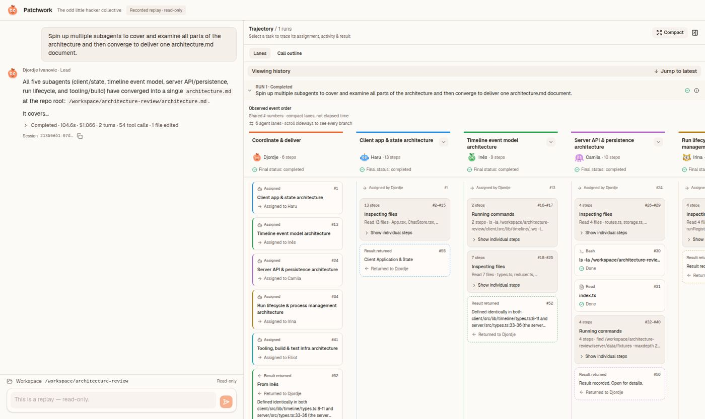

# Patchwork

A local web console for Claude Code that shows a run as a team at work: named subagents, one lane per agent, and handoff cards for what each one was assigned and what it returned.



Created by Djordje Ivanovic.

## What it does

Patchwork runs the `claude` CLI in a folder you choose and streams everything it does into a three-column app: chat history on the left, the conversation in the middle, and a collapsible **Trajectory** panel on the right.

- **Delegation as handoffs.** In the **Lanes** view each agent gets its own column. The lead's lane lists what was delegated, in order ("Assigned · Client app & state architecture → Assigned to Haru"), and then the returns with an excerpt of each answer ("Result returned · From Inês → Returned to Djordje"). Each subagent lane opens with "Assigned by Djordje" and ends with "Result returned". You can follow who was asked what and what came back without opening a tool card.
- **Named agents.** The main agent is "Djordje Ivanovic · Lead". Subagents become characters (Haru, Inês, Camila, Irina, Elliot and more, 13 in all) with an avatar and colour that stay the same in the chat, the lanes and later resumed runs. Click the mascot in the top bar to meet the crew. The characters are only on screen: they are never added to prompts or sent to the model.
- **Readable long runs.** Adjacent reads, searches, edits and shell commands in a lane fold into one card ("13 steps · Inspecting files · Read 13 files · App.tsx, ChatStore.tsx…") with **Show individual steps**. Failures are lifted out under **Steps needing attention**, not buried in a group.
- **Honest ordering.** Events share global `#` numbers across lanes, labelled "Observed event order · compact lanes, not elapsed time". You can see how parallel agents interleaved without the panel claiming a precise timeline.
- **Inspector and outline.** Select an agent or a step to highlight its lane and open a **Task / Activity / Result** inspector, then jump to the exact tool call in the conversation. **Call outline** switches to a nested list of tool names with foldable branches.
- **Conversation view.** Streaming Markdown replies; tool rows with Claude's description, input, output, a copy button and a ✓ / ✗ / spinner status; diffs for Edit and Write; subagent calls nested under their Agent row. Each run ends with a footer such as "Completed · 16.9s · $0.090 · 6 turns · 5 tool calls" and its session id.
- **Live status and control.** While a run is active a strip shows elapsed time and the current action ("Running · 14s · Read: …/game.js") with a **Stop** button. Follow-up prompts resume the same Claude session.
- **Several chats at once.** Every chat keeps its own workspace and session. Runs are not tied to the browser tab: refresh or open a second tab and it reattaches to the running process. Chats are saved to disk, and a server restart marks orphaned runs as interrupted.
- **Workspace picker.** Paste a path (including `~/…`), browse folders, pick a recent workspace, or use the bundled scratch workspace.
- **Replay.** Any recorded run, including a raw `claude --output-format stream-json` capture, can be replayed read-only through the same components.

## Requirements

- Node.js 20.19+ or 22.12+ (tested with Node 22.22) and npm 10+.
- For live mode only: the [Claude Code](https://docs.claude.com/en/docs/claude-code) CLI (`claude`) on your `PATH`, already logged in. Replay works without it.

## Quick start

```bash
cd patchwork
npm ci
npm run dev
```

`npm run dev` starts two processes: the Vite web server on port 8000 and an internal API server on 127.0.0.1:8001 that Vite proxies to. Open http://localhost:8000 (or `http://<your-machine-ip>:8000` from another machine). The browser only ever needs port 8000.

Stop both with Ctrl+C.

## Try it without Claude (replay)

Recorded runs live in `server/data/fixtures/`. With `npm run dev` running, open one by adding `?replay=<name>` to the URL. There is no in-app picker; http://localhost:8000/api/fixtures lists the names.

| URL | What it shows |
|---|---|
| http://localhost:8000/?replay=subagent-concurrent-review | A real architecture review: the lead hands five parts of the codebase to five parallel subagents, collects their reports and writes one document (54 tool calls). The best showcase. |
| http://localhost:8000/?replay=trajectory-history | Three prompts in one session: a flat run, two concurrent reviewers with a nested delegation and one failed assignment, and a follow-up that resumes an earlier agent. |
| http://localhost:8000/?replay=subagent | A subagent that writes a file, nested under its Agent row. |
| http://localhost:8000/?replay=basic | A flat Write → Bash → Read run. |
| http://localhost:8000/?replay=raw-stream | A raw `stream-json` capture imported as is (the prompt was not recorded, and the viewer says so). |

Replays are read-only and do not start `claude`. On a replay the trajectory panel starts closed:

1. Open http://localhost:8000/?replay=subagent-concurrent-review.
2. Click the panel icon at the top right of the conversation (**Show trajectory**).
3. Make sure **Lanes** is selected, then click **Wide view**.

## Things to try

- In `?replay=subagent-concurrent-review` with **Lanes** and **Wide view**: read the lead's "Assigned → Assigned to …" cards, then scroll sideways through the six lanes (Djordje plus Haru, Inês, Camila, Irina and Elliot) and compare the interleaved `#` numbers.
- Click an agent in a lane header, for example Haru: the lane lights up and the Task / Activity / Result inspector opens. **Open selected step in conversation** jumps to the call.
- Expand a "13 steps · Inspecting files" card with **Show individual steps**.
- Switch to **Call outline**, fold an Agent branch, and click a nested Read to reveal it in the conversation.
- In the conversation, expand "Agent · Haru … 15 nested" to see the subagent's own tool calls.
- Open `?replay=trajectory-history` to see three runs in one panel and a red "Assignment failed" card.
- Click the mascot next to "Patchwork" in the top bar to meet the 13 characters.
- Drag the panel's left edge to resize it, or narrow the window to get the mobile drawers.

## Live mode with Claude Code

Open http://localhost:8000 without `?replay`. On first load the app creates a chat in the bundled scratch workspace, `server/data/scratch-workspace/` (its contents are git-ignored), and you can start prompting.

For a ready-made task, prepare a disposable copy of the small demo project in `demo-project/`:

```bash
npm run demo:prepare
```

It prints a new temporary folder (for example `/tmp/patchwork-linecount-XXXXXX`). Click **Change** above the prompt box, paste that path and choose **Use workspace**. The project is a tiny line-count CLI with one intentionally failing test. Ask Claude to fix the trailing-newline bug and rerun the tests, then ask for a follow-up or have it delegate a review to subagents. Each `demo:prepare` makes a fresh copy.

Each prompt runs this in the chosen workspace:

```
claude -p "<prompt>" --output-format stream-json --verbose \
  --permission-mode bypassPermissions --forward-subagent-text [--resume <session-id>]
```

- **Permissions are bypassed.** A headless child process cannot answer permission prompts, so every run uses `--permission-mode bypassPermissions`. Claude can read, write and run commands with your user's privileges. The workspace is a starting directory, not a sandbox. Only point Patchwork at scratch folders, never at your home folder or anything you care about.
- Runs use your existing Claude Code login. If `ANTHROPIC_API_KEY` is set in the environment that starts Patchwork, Claude Code may use that key instead, so leave it unset if you want to use your login.
- Follow-up prompts in a chat pass `--resume` with the session id from the previous run. Choosing a different workspace starts a new chat; existing chats and running work are left alone.
- Closing or refreshing the tab does not stop a run. Only **Stop** does (it sends SIGTERM to the `claude` process).
- If `claude` is missing or fails to start, the run is shown as **Failed** with the error message.
- Chats are saved under `server/data/chats/<id>/` (`meta.json` and `events.jsonl`). Delete a chat from the sidebar menu or remove its folder.

### Example prompt

A prompt that makes Claude delegate:

```
Spawn subagents to explore the repo and report the most creative features
```

"The repo" is the chat's workspace. The picker accepts any existing folder, so make a disposable clone of this app collection, which gives the subagents seven apps to compare:

```bash
git clone --depth 1 https://github.com/HarvardMadSys/CS2680-Assignment1-Mads-Lens.git ~/scratch/mads-lens
```

Click **Change**, paste `~/scratch/mads-lens`, choose **Use workspace** (this starts a new chat there) and send the prompt. There is nothing to enable first: Patchwork passes no `--allowedTools` or `--disallowedTools` list and no turn or budget cap, so with `bypassPermissions` the subagent tool (`Agent`, called `Task` in older Claude Code versions) is available as usual. While the run is active the Trajectory panel opens in **Lanes**: watch the lead's "Assigned → Assigned to …" cards appear as each subagent gets a named lane, click **Wide view** to see the lanes side by side, and wait for the "Result returned" cards. The panel closes when the run ends; reopen it with **Show trajectory**.

## Configuration

All settings are environment variables, for example `PORT=9000 npm run dev`.

| Variable | Default | Purpose |
|---|---|---|
| `PORT` | `8000` | Browser-facing port (Vite dev server). |
| `HOST` | `0.0.0.0` | Interface the browser-facing server binds to. Use `127.0.0.1` to keep it local. |
| `API_PORT` | `8001` | Internal API server port. Vite proxies `/api` to it. |
| `API_HOST` | `127.0.0.1` | Interface the internal API binds to. It does not need to be reachable from other machines. |
| `ALLOWED_HOSTS` | unset | Comma-separated extra hostnames the dev server accepts (for example `mybox.local`). `localhost` and IP addresses always work. |
| `PATCHWORK_DATA_DIR` | `server/data` | Where chats, fixtures (`fixtures/`) and the scratch workspace live. If you change it, copy the fixtures there to keep replays working. |
| `PATCHWORK_API_TARGET` | `http://127.0.0.1:$API_PORT` | Full URL Vite proxies `/api` to, if the API runs elsewhere. |

The dev server uses a fixed port: if 8000 is taken it exits with an error instead of moving to another port.

## Security note

Patchwork has no authentication. It listens on 0.0.0.0 by default, so anyone who can reach port 8000 can use it, and in live mode that means running Claude Code on your machine, with permission prompts bypassed, in any existing folder they choose. On untrusted networks start it with `HOST=127.0.0.1 npm run dev`.

## Development

| Command | What it does |
|---|---|
| `npm run dev` | Web server and API together, with auto-reload. |
| `npm run dev:client` / `npm run dev:server` | Only one side. |
| `npm test` | Vitest suites for client and server. |
| `npm run typecheck` | `tsc --noEmit` for both workspaces. |
| `npm run lint` / `npm run format:check` | Biome lint and format checks (`biome.json`). |
| `npm run build` | Production build of client and server. |
| `npm run check` | Format check, lint, typecheck, tests and build in one go. |

`scripts/verify-trajectory.mjs` is an end-to-end browser check that never calls Claude: it puts a fixture-driven fake `claude` (`scripts/fixtures/claude.cjs`) on the `PATH`, starts temporary servers on ports 3197 and 5197 with a throwaway data folder, and drives real prompt submissions, refreshes, a server restart and the trajectory views. It needs Playwright with Chromium; with a global install:

```bash
npm run build
PLAYWRIGHT_MODULE="$(npm root -g)/playwright/index.mjs" node scripts/verify-trajectory.mjs
```

`scripts/verify-live.mjs` is a similar check against the real CLI. It spends Claude usage and only runs when `PATCHWORK_LIVE_VERIFY=1` is set.

### Project layout

```
client/                 React 19 + TypeScript + Vite + Tailwind/shadcn UI
  src/state/            ChatStore: chats, active chat, live and replayed timelines
  src/lib/timeline/     event reducer, selectors, lanes and activity grouping (pure, tested)
  src/components/       conversation, tool rows, trajectory panel, agent characters
server/                 Express 5 + TypeScript API
  src/claudeRunner.ts   spawns `claude` and parses stream-json
  src/runRegistry.ts    keeps runs alive independently of HTTP connections
  src/routes.ts         /api/chats, /api/run, /api/fixtures, /api/workspaces
  data/fixtures/        recorded runs for replay
demo-project/           disposable demo task used by `npm run demo:prepare`
scripts/                demo preparation and browser verification
```

Live runs, restored chats and replays all produce the same event envelope and go through one reducer, so they render identically. See [architecture.md](architecture.md) for the event model, the API routes and the run lifecycle.

## Known limitations

- Replays are opened by URL only; there is no picker in the UI.
- Opening the live page creates a chat folder under `server/data/chats/` (git-ignored).
- The lanes show observed order, not time: there are no per-tool durations, token counts or an elapsed-time view.
- With many subagents the lanes need sideways scrolling, even in **Wide view**.
- Agent rows for background subagents show the raw "Async agent launched successfully…" tool result as their immediate output.
