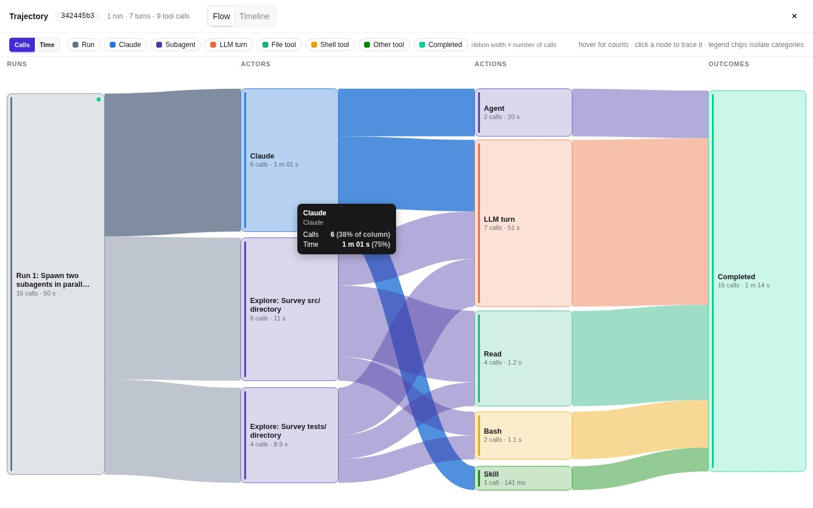

# Sankey Flow

A web frontend for headless Claude Code that draws where a run's calls and time went as a Sankey diagram, with live speed gauges and an animated cat.



Created by Ibrahim Khaliliya.

## What it does

Sankey Flow is a small Flask app. You pick a working directory and type a prompt. The server runs
`claude -p ... --output-format stream-json` as a subprocess and relays every event to the browser over
Server-Sent Events as it arrives. It can also reopen past Claude Code sessions from `~/.claude/projects`
without running Claude at all.

- **Flow view: a Sankey of the whole session.** Four columns, **Runs → Actors → Actions → Outcomes**. A run
  is one prompt. Actors are Claude and each subagent. Actions are one shared "LLM turn" node plus one node
  per tool (Read, Bash, Agent, ...). Outcomes are Completed / Failed / Stopped, plus In progress while a run
  is live. Ribbon thickness is usage, and a **Calls | Time** toggle switches between the number of calls and
  the time spent. Hover a node or ribbon to see its calls, time and share of the column. Click a node to
  trace it in the transcript, or click a legend chip to fade everything outside one category.
- **Timeline view: the step graph.** A Cytoscape.js + dagre graph of the session in time order: runs,
  assistant messages, thinking, tool calls and results. Each subagent's own steps sit in a dashed box. It
  has search (Enter cycles through the matches), zoom and fit, a top-down / left-right toggle, and a
  "follow" switch that keeps the newest step in view during a live run. Click a node to jump to its card.
- **Trajectory card.** A thumbnail of the Flow diagram, whole-session counts (LLM turns, tool calls,
  subagents, failures), the most-used tools as `Read ×4` badges, and the wall time. All of it updates
  while a run streams. **Expand** opens the full-screen Flow / Timeline modal.
- **Pace strip and the cat** (live runs only). The server passes `--include-partial-messages`, and the page
  times the token-level stream events to show **TTFT** (time to first token, per API request, with an
  average), **TPOT** (ms per output token, plus smoothed tokens/s) and **latency** (last tool call and last
  full API turn). The cat sleeps when idle, sits while waiting for a token or a tool, walks below
  25 tokens/s and runs at or above it. Its animation speed follows the token rate.
- **Readable transcript.** Assistant text is rendered as markdown. Thinking rows show a token estimate.
  Tool calls are cards with their key inputs, results and a pending / completed / failed status. Subagent
  activity is nested under the Agent call that spawned it. The `init` event is decoded (model, permission
  mode, tool and MCP server counts), and hook, compaction, permission-denial and API-error events get their
  own lines. When a run finishes, its footer shows cost, duration, API time, turns, tokens in and out,
  subagents, TTFT and TPOT.
- **Policy panel.** A per-run budget cap, a checklist of allowed built-in tools and deny patterns. They are
  turned into `--max-budget-usd`, `--tools` and `--disallowedTools` (details below).
- **Sessions browser.** Lists earlier Claude Code sessions, whether started from this page or from a
  terminal. Opening one rebuilds it in the transcript and both trajectory views, and the next prompt you
  send continues it with `--resume`.

## Requirements

- Python 3.9 or newer (tested with 3.11). The only dependency is Flask.
- No Node.js and no build step: daisyUI, the Tailwind browser runtime, Cytoscape.js and dagre are bundled in
  `static/vendor/`.
- The [Claude Code](https://docs.anthropic.com/en/docs/claude-code) CLI (`claude`), installed and logged in,
  but **only for live mode**. Reopening sessions and the bundled demo work without it.

## Quick start

```bash
cd sankey-flow
python3 -m venv .venv
.venv/bin/pip install -r requirements.txt
.venv/bin/python app.py
```

Open http://localhost:8000 (or http://<your-machine-ip>:8000 from another machine).

Started this way, **Sessions** lists your own Claude Code sessions from `~/.claude/projects`.

## Try it without Claude (bundled demo session)

The folder ships one recorded Claude Code session in `demo/claude-projects/`, stored in Claude Code's own
transcript format. In it, Claude runs a Skill and then sends two Explore subagents in parallel to survey a
small Python project (`src/` and `tests/`). The session has 1 run, 7 LLM turns and 9 tool calls.

1. Start the app with the `--demo` flag, which reads sessions from the bundled folder instead of
   `~/.claude/projects`:

   ```bash
   .venv/bin/python app.py --demo
   ```

   Setting the store yourself does the same thing:
   `CLAUDE_PROJECTS_DIR=$PWD/demo/claude-projects .venv/bin/python app.py`.
2. Open http://localhost:8000 and click **Sessions** (top right).
3. Tick **all directories**. The list starts filtered to the current working directory, and the demo was
   recorded in a different one. Then click the session.
4. The transcript rebuilds, with both subagents nested under their Agent cards. The note under the prompt
   box says the session's original directory doesn't exist on this machine, so it can be reviewed but not
   continued.
5. Press **Expand** on the Trajectory card (left) for the Flow and Timeline tabs.

## Things to try

- **Flow → Calls vs Time.** In Calls mode the three actors are close in size. Switch to **Time** and
  "LLM turn" takes over the Actions column (7 calls, about 51 s, against about a second each for Read
  and Bash). Hover any node or ribbon for its share.
- **Trace a tool.** Click the **Read** node. The four Read cards in the transcript are outlined and the
  rest fade. Press **Clear highlight** or Escape to reset. Clicking a Run node or a subagent actor closes
  the modal and flashes that card.
- **Isolate a category.** Click the **Subagent** legend chip to fade everything else, and click it again
  to undo.
- **Timeline search.** Open the **Timeline** tab and type `Read`. Matching steps are highlighted
  ("5 of 16"), and Enter cycles through them. Try **Top-down / Left-right** and **Fit**.
- **Theme.** Use the Auto / Light / Dark switch in the header. The Sankey palette and the graph colours
  follow it.
- **Live only:** run a short prompt in a scratch folder and watch the cat wake up and the TTFT / TPOT /
  latency tiles fill in. Replayed sessions contain no token-level events, so there the tiles show "—"
  and the cat stays asleep.

## Live mode with Claude Code

Prerequisites: the `claude` CLI on your `PATH` (or set `CLAUDE_BIN`), logged in. Live runs spend your Claude
usage.

For every prompt the server runs

```
claude -p "<prompt>" --output-format stream-json --verbose --dangerously-skip-permissions \
    --include-partial-messages \
    [--resume <session_id>] [--max-budget-usd <amount>] [--tools <names>] [--disallowedTools <pattern>...]
```

with the selected working directory as its `cwd`.

> **Every run uses `--dangerously-skip-permissions`.** Claude can read, write and delete files and run
> shell commands in the chosen directory, and beyond it, without asking. Only point it at a scratch folder.

**Choosing a working directory.** On first launch the picker starts in `workspace/`, a scratch folder that
the app creates next to `app.py` and that git ignores. To start somewhere else, set
`CLAUDE_FRONTEND_WORKDIR=/path/to/scratch`. The picker can still browse to any directory: **Jump to…** lists
Home, the scratch workspace, the disk root and the folders in `CLAUDE_FRONTEND_DIRS`. You can also type or
paste a path and press Enter, use **↑ Up**, or pick a subfolder. The browser remembers the last directory
you used. Once a session has started, the picker is locked to that session's directory until you press
**New session**.

Press **Run** (or ⌘/Ctrl + Enter). Follow-up prompts continue the same session with `--resume`, and
**Stop** terminates the running process.

**Policy panel** (the collapsible row above the prompt box). Its settings apply to the next run and are
remembered in the browser.

| Control | Effect | Flag |
|---|---|---|
| Budget cap (USD), with 0.25 / 1 / 5 / none presets | The most one run may spend. Claude checks the cap after each turn, so a single turn can overshoot a small cap. | `--max-budget-usd <amount>` |
| Allowed tools, a checkbox per built-in tool, with all / none / read-only presets | Restricts Claude's built-in tools. With everything checked, the flag is omitted. MCP tools are not affected by this flag. | `--tools <name,...>` |
| Deny patterns, comma-separated | Rules refused even for allowed tools, e.g. `Bash(git push *)`, `Edit`, `mcp__server__tool`. Up to 50 rules of 200 characters each. | `--disallowedTools <pattern> ...` |

The server validates the policy and rejects bad input with HTTP 400 and a plain message.

**Example prompt.** A prompt that makes Claude delegate, so there are subagents to watch:

```
Spawn subagents to explore the repo and report the most creative features
```

"The repo" is the working directory. Any existing directory is accepted, and a throwaway clone of this
collection makes a safe scratch folder with seven apps for the subagents to compare:

```bash
git clone --depth 1 https://github.com/HarvardMadSys/CS2680-Assignment1-Mads-Lens.git ~/scratch/mads-lens
```

Type `~/scratch/mads-lens` into the **Working directory** field and press Enter (after **New session**, if a
session is open). Nothing has to be enabled for subagents: the server adds no turn cap, and with every tool
checked (the default) it sends no `--tools` flag. The Policy panel is remembered, though, and its
**read-only** and **none** presets leave out **Task (subagents)**, so Claude cannot start any. Press **all**
or tick that box again, and keep `Task` and `Agent` out of the deny patterns. (Newer Claude Code versions
call the tool `Agent`; the **Task** box still enables it.) If you set a budget cap, leave room: several
subagents cost more than a short prompt.

While it runs, press **Expand**: each subagent joins the Flow's Actors column under its type and description,
its Agent call sits in **In progress** until the report comes back, and **Time** shows which one Claude
waited on longest. The cat and pace tiles follow the main agent only, so the cat sits ("waiting") while
Claude waits on them.

## Configuration

| Setting | Default | Purpose |
|---|---|---|
| `PORT` / `--port` | `8000` | HTTP port |
| `HOST` / `--host` | `0.0.0.0` | Interface to bind. Use `127.0.0.1` to accept local connections only. |
| `--demo` | off | Read sessions from the bundled `demo/claude-projects/` instead of `~/.claude/projects` |
| `CLAUDE_PROJECTS_DIR` | `~/.claude/projects` | Claude Code transcript store that the Sessions browser reads |
| `CLAUDE_FRONTEND_WORKDIR` | `./workspace` (next to `app.py`) | Where the directory picker starts on first launch. Created if missing. |
| `CLAUDE_FRONTEND_DIRS` | empty | Extra quick-jump folders for the picker, `:`-separated |
| `CLAUDE_BIN` | `claude` | Path to the Claude Code executable |

Example: `HOST=127.0.0.1 PORT=8140 .venv/bin/python app.py`, or the same with flags,
`.venv/bin/python app.py --host 127.0.0.1 --port 8140`.

## Security note

By default the server listens on `0.0.0.0:8000`, so anyone who can reach that port can use the app. That
includes browsing your file system's directory names, reading your past Claude Code sessions and, in live
mode, running Claude Code with `--dangerously-skip-permissions` on your machine. There is no
authentication. On an untrusted network, start it with `HOST=127.0.0.1`. The server is Flask's built-in
development server, which is meant for local use.

## How the numbers are defined

- **TTFT**: from the start of a request (the run start, or the last tool result handed back to Claude) to
  the first streamed content of the reply. **TPOT**: the message's streaming time divided by
  `max(1, tokens − 1)`. tokens/s is `1000 / TPOT`, smoothed with an exponential moving average.
  **Latency**: the last tool call (`tool_use` → `tool_result`) and the last full API turn.
- **Flow time is resource time, not wall-clock time.** Tool calls that run in parallel, tools that run
  while the model is still streaming, and subagents (counted once in Claude's Agent wait and once on their
  own lane) all overlap. That is why the Actors and Outcomes columns can add up to more than a run's wall
  time. The tooltips say "latencies overlap" where this applies.
- The trajectory card counts the whole session, including subagents. Its "LLM turns" can therefore be
  higher than the "Turns" in a run footer, which counts the main agent only.

## Project layout

| Path | Role |
|---|---|
| `app.py` | Flask server: directory browsing, the session store reader, the run launcher, the SSE stream and stop |
| `templates/index.html` | Page layout (daisyUI components), the sessions and trajectory modals, and the inline-SVG cat |
| `static/app.js` | Event rendering, run and tool status, sessions, pace metrics and the cat, the trajectory tree and summary card, and the Flow and Timeline wiring |
| `static/flow.js` | `CCFlow`: builds the Runs → Actors → Actions → Outcomes dataset and draws it as a dependency-free SVG Sankey |
| `static/style.css` | Layout, the pace strip and cat animation, the Flow palette, graph tooltips and markdown styles |
| `static/vendor/` | daisyUI 5, Tailwind 4 browser runtime, Cytoscape.js, dagre, cytoscape-dagre |
| `demo/claude-projects/` | One recorded session (with two subagent transcripts) for trying the app without Claude |

## Known limitations

- Runs are kept in memory only. Restarting the server forgets live runs, but anything Claude Code saved to
  its own transcript store can be reopened from **Sessions**.
- A reopened session whose original directory no longer exists (such as the bundled demo) can be reviewed
  but not continued.
- Replayed sessions have no token-level stream events, so the pace tiles and the cat only work in live runs.
