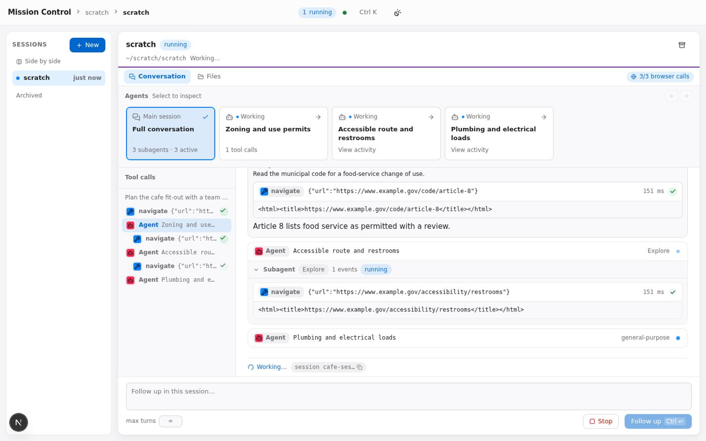

# Subagents as a team

An **Assignment 1** project by **Saul Richardson** for **Harvard CS 2680: Modern AI Systems (Fall 2026)**.

Subagents as a team explores how to follow a coding agent when its work spreads across sessions and
subagents. It gives each delegated task a card you can open, inspect and return from, while keeping
the larger conversation in view.



## Design and features

The central idea is to move between an overview of the team and the details of one agent's work.
Pick a folder, give Claude Code a task, and watch the conversation, tool calls and delegated work
arrive. Sessions retain their history for follow-ups, replay and comparison.

- **A card for every subagent.** The agents strip shows each subagent's task, working or finished
  state, tool-call count and any agents it has spawned. The main-session card summarizes the team,
  for example, "3 subagents · 3 active".
- **Focused subagent views.** Click a card to narrow the conversation and tool outline to that
  agent's assignment, activity, duration, token and tool counts, and returned report. Use
  **‹ Conversation** or **Main session** to return to the overview.
- **An outline and inspector.** The outline groups calls under the prompt that started them,
  colors them by tool, marks success or failure, and nests delegated calls under their `Agent`
  call. Click an outline row to jump to a call; open the call to inspect its status, start time,
  duration, parent tool-use id, input and result.
- **Readable tool results.** Cards show commands, edit diffs, line-numbered file reads and
  expandable output. Run summaries include outcome, cost, duration and turn count; the header
  tracks context size. A run that fails to start is distinguished from a failed tool call within
  a completed run.
- **Sessions that continue.** The composer resumes the same Claude session with `--resume`.
  You can limit turns or stop a run. Sessions and raw events are stored in SQLite.
- **Replay, import and export.** Replay a finished run instantly, at recorded speed or at 4×.
  Import an `events.jsonl` from this app or from `claude -p --output-format stream-json`, or
  download a run in the same format. Playback is labeled and never starts an agent.
- **Files alongside the conversation.** The **Files** tab previews text, Markdown, images and
  sandboxed HTML/SVG from the session's folder.
- **Compare and combine sessions.** Projects group sessions by folder and show up to three side
  by side. **Bring together** starts a new session using their prompts, final replies, subagent
  reports and files you select. New sessions can also use isolated Git worktrees.
- **Navigation and status.** A command palette (Ctrl+K / ⌘K), light and dark themes, and completion
  toasts support moving through longer sessions.

## Requirements

- **Node.js 22 or newer.**
- **pnpm 10.** If it is not installed, substitute `npx -y pnpm@10` for `pnpm` in the commands
  below, for example, `npx -y pnpm@10 install` and `npx -y pnpm@10 demo`.
- **Git**, only for optional isolated-worktree sessions.
- **Claude Code**, installed as `claude` on your `PATH` and signed in, only for live mode.
  The demo does not require Claude Code.

## Quick start

From the collection's root directory:

```bash
cd subagents-as-a-team
pnpm install
pnpm demo
```

Open [localhost:8000](http://localhost:8000), or `http://<your-machine-ip>:8000` from another machine.

`pnpm demo` uses a bundled stand-in for the Claude CLI. It lets you explore the interface without
installing Claude Code or consuming Claude usage. For live runs, start with `pnpm dev` instead;
see [Live mode with Claude Code](#live-mode-with-claude-code).

For a production build:

```bash
pnpm build
pnpm start
```

This uses the real CLI by default. The next section includes a production-build demo command.

## Try it without Claude (replay / demo)

Demo mode points the app at `tests/fake-claude/claude`. This script responds like
`claude -p --output-format stream-json`, playing a recording from `fixtures/` at one event every
150 ms. It never calls Claude.

1. Start `pnpm demo` and open [localhost:8000](http://localhost:8000).
2. Select **New folder**, then **Create**. This creates an empty folder under `~/scratch/`, such
   as `~/scratch/scratch`. You can also type or browse to an existing folder; the fake CLI does
   not change its contents.
3. Enter a prompt and select **Start session** (Ctrl+Enter / ⌘↵). The prompt selects a recording:
   - `FIXTURE:team-cafe` plays a synthetic run with three parallel subagents, one of which delegates again.
   - A prompt mentioning "subagent", such as `Use a subagent to survey this repository`, plays a real recorded run with one subagent.
   - A change request such as "fix the bug…", "add…" or "implement…" plays a recording of a real run that edits files.
   - A prompt mentioning "max turns" plays a run that reaches `--max-turns` and fails.
   - Other prompts play a short real run without subagents.

   You can select a recording directly with `FIXTURE:<name>`, which plays `fixtures/<name>.jsonl`.
4. Once a session exists, press Ctrl+K / ⌘K and choose **Import a recorded events.jsonl**. Select
   `fixtures/team-cafe.jsonl` or `fixtures/subagent-forward.jsonl`, then **Import**.
5. On a finished prompt, open **…** and choose **Replay → Instantly**, **At recorded speed** or **At 4×**.

To use the fake CLI with a production build:

```bash
pnpm build
SUBAGENTS_AS_A_TEAM_CLAUDE_BIN=$PWD/tests/fake-claude/claude FAKE_CLAUDE_DELAY_MS=150 pnpm start
```

## Explore the design

With `pnpm demo` running, try this sequence:

1. In a new folder, submit `Plan the cafe fit-out with a team of subagents FIXTURE:team-cafe`.
   Watch the three subagent cards work concurrently and finish as the main card updates its counts.
2. Open a card such as **Zoning and use permits**. Follow that agent's task, activity and report,
   then select **Main session** to return to the full conversation.
3. Open a tool call or select it in the outline. Inspect its timing, parent id, input and result.
4. Send a follow-up from the **Follow up in this session…** composer.
5. Import `fixtures/team-cafe.jsonl` through the command palette, then replay it at recorded speed.
6. Browse the **Files** tab and use **Side by side** in the sidebar to compare sessions.

## Live mode with Claude Code

1. Install Claude Code, sign in, and check that `claude --version` works in the same shell.
2. Start with `pnpm dev`, or `pnpm build && pnpm start`, and open [localhost:8000](http://localhost:8000).
3. Select a disposable working folder and submit a prompt. **New folder** creates one under
   `~/scratch/`. Avoid folders containing secrets or work you cannot afford to change.

Each run starts in the selected folder with:

```
claude -p <prompt> --output-format stream-json --verbose --forward-subagent-text --chrome \
  --permission-mode acceptEdits \
  --allowedTools Bash,Read,Edit,Write,MultiEdit,NotebookEdit,Glob,Grep,LS,Agent,Task,WebFetch,WebSearch,TodoWrite,Skill,mcp__claude-in-chrome
```

Follow-ups add `--resume <session id>`. Setting a turn limit adds `--max-turns`.

**The working folder is not a sandbox.** File edits are accepted automatically, and `Bash` is on
the allowlist, so the agent can run shell commands with your account's privileges without asking.
Set `SUBAGENTS_AS_A_TEAM_ALLOWED_TOOLS` to change the tool list.

Live runs use your CLI login. The server removes `ANTHROPIC_API_KEY`, `ANTHROPIC_AUTH_TOKEN` and
`ANTHROPIC_BASE_URL` from the child process's environment.

Each run also requests the [Claude in Chrome](https://code.claude.com/docs/en/chrome) browser tools
with `--chrome`. If the extension is missing or Chrome is closed, the session reports those tools
as unavailable; the rest of the app continues to work.

### Example prompt

To see delegation in a live run, try:

```
Spawn subagents to explore the repo and report the most creative features
```

The repository is the session's working folder. A disposable clone of this collection gives the
subagents six projects to compare:

```bash
git clone --depth 1 https://github.com/HarvardMadSys/CS2680-Assignment1-Mads-Lens.git ~/scratch/mads-lens
```

Subagents as a team accepts folders other than your home folder and the filesystem root. Enter the
clone's full path in **Folder** (`echo ~/scratch/mads-lens` prints it); the app does not expand `~`.
Alternatively, use **Browse**, which starts at your home folder, and select `scratch`, then `mads-lens`.

Submit the prompt with **Start session**. The default allowlist includes `Agent` and `Task`, the
newer and older names of the subagent tool, so no extra setting is needed. Keep both names if you
customize `SUBAGENTS_AS_A_TEAM_ALLOWED_TOOLS`. There is no budget cap, and turns are limited only
when you fill in **max turns**.

Each new subagent appears in the agents strip with its task, state and tool-call count. Open its
card to follow its calls and read its report when it finishes. The **Main session** card tracks
the total number of subagents and how many remain active.

## Configuration

Set these environment variables before starting the server.

| Variable | Default | Purpose |
| --- | --- | --- |
| `PORT` | `8000` | Port to listen on. |
| `HOST` | `0.0.0.0` | Address to bind. `127.0.0.1` accepts connections from this machine only. |
| `SUBAGENTS_AS_A_TEAM_ALLOWED_HOSTS` | (none) | Extra hostnames the server answers to, comma-separated, for example `mc.example.org` (see [Security](#security)). Loopback names, IP addresses and this machine's hostname are always accepted. `*` accepts any hostname. |
| `SUBAGENTS_AS_A_TEAM_CLAUDE_BIN` | `claude` | The Claude Code executable. Use an absolute path if it isn't on `PATH`. |
| `SUBAGENTS_AS_A_TEAM_ALLOWED_TOOLS` | the list above | The `--allowedTools` list for runs (the Chrome tools are always added). |
| `SUBAGENTS_AS_A_TEAM_DATA_DIR` | `.data/` in this folder | SQLite database and Bring-together packages. |
| `SUBAGENTS_AS_A_TEAM_SCRATCH_ROOT` | `~/scratch` | Where **New folder** creates folders. |
| `FAKE_CLAUDE_DELAY_MS` | `2` (`150` in `pnpm demo`) | Delay between events for the fake CLI. |

For example: `PORT=9000 HOST=127.0.0.1 pnpm dev`.

## Security

Subagents as a team has **no authentication** and listens on **all interfaces (`0.0.0.0`)** by default.
Anyone who can reach port 8000 can read sessions and, in live mode, start Claude Code runs with
Bash allowed and no permission prompts. The API also exposes a comparison endpoint, unused by
the UI, that can start runs with `--dangerously-skip-permissions`. On a shared or untrusted network,
start the app with `HOST=127.0.0.1`.

The server checks requests and WebSockets. The `Host` header must be a loopback name, an IP address,
this machine's hostname or a name in `SUBAGENTS_AS_A_TEAM_ALLOWED_HOSTS`; the browser's `Origin`
must match that host. These checks address DNS rebinding and requests from other web pages. They
do not prevent people who can reach the server from using it.

`SUBAGENTS_AS_A_TEAM_ALLOWED_HOSTS=*` accepts any hostname, which turns the DNS-rebinding protection off: a web page you visit could then drive the console through a hostname it controls. Use it for a console you are deliberately making public, where anyone who can reach it can use it anyway. Otherwise, list the names you use.

## Development

```bash
pnpm test        # unit tests (Vitest)
pnpm typecheck
pnpm lint        # Biome
```

Tests use the same fake CLI and fixtures. `pnpm fixtures:team` and `pnpm fixtures:synth` regenerate
the two synthetic recordings.

| Area | Source |
| --- | --- |
| HTTP server, request checks, startup and shutdown | [server.ts](server.ts), [src/server/net/localOnly.ts](src/server/net/localOnly.ts) |
| Running the CLI and cancelling runs | [src/server/process/](src/server/process/) |
| Event reducer, tool pairing, subagents | [src/core/](src/core/) |
| UI | [src/app/](src/app/), [src/ui/](src/ui/) |
| API, storage, streaming | [tRPC router](src/server/trpc/router.ts), [SQLite/Drizzle](src/server/db/), [WebSocket hub](src/server/ws/hub.ts) |
| Recordings and the fake CLI | [fixtures/](fixtures/), [tests/fake-claude/](tests/fake-claude/) |

For more detail, see the [architecture](docs/approach.md), [product intent](docs/product-intent.md),
[engineering decisions](docs/records/README.md) and [stream-json event reference](docs/reference/claude-stream-json-types.md).

## Known limitations

- Imports need an existing session with no run in progress. On a fresh install, create one first;
  any prompt in `pnpm demo` will do.
- Sessions are stored in `.data/`, and **New folder** creates `~/scratch/scratch*`. Removing those
  locations resets the corresponding saved data and scratch folders.
- The **Files** tab shows the folder's current contents. Replay reconstructs the conversation,
  not the files as they existed during the run.
- Archiving a session hides it without deleting its files or Git worktrees.
- Reverse proxies and DNS aliases need their hostname in `SUBAGENTS_AS_A_TEAM_ALLOWED_HOSTS`,
  or `*` to accept any hostname (see [Security](#security)).
  Changing the port alone, as with `ssh -L 9000:localhost:8000` or `docker run -p 3080:8000`,
  needs no extra setup.
- In `pnpm dev` and `pnpm demo`, Next.js also blocks dev assets for addresses that are not this
  machine's own, such as a Docker host's IP. Add the address to `SUBAGENTS_AS_A_TEAM_ALLOWED_HOSTS`
  (`*` covers any name containing a dot), or use `pnpm build && pnpm start`.
- Process-group cancellation targets macOS and Linux. Windows has not been tested, and the
  `pnpm` scripts use POSIX shell syntax.

[Back to the Assignment 1 showcase](../README.md)
