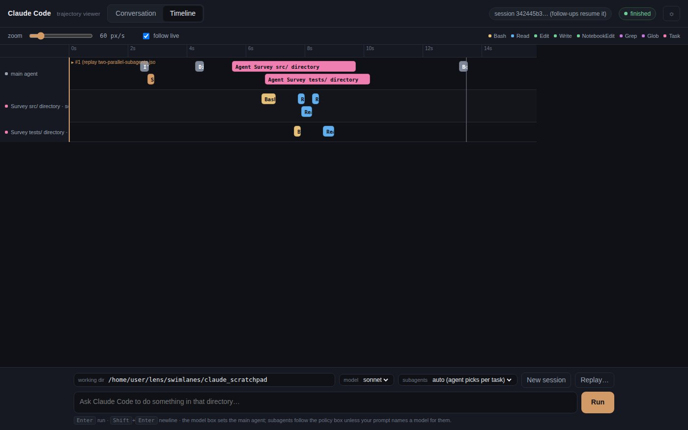

# Swimlanes

An **Assignment 1** project by **Eric Gong** for **Harvard CS 2680: Modern AI Systems (Fall 2026)**.

Swimlanes makes parallel agent work visible by placing every agent on a shared time axis. Tool
calls occupy the time they took, so overlapping work is easy to compare. A conversation view
connects that picture back to the prompts, responses and results behind each block.



## Design and features

The project explores how a timeline can explain concurrency in a Claude Code session. It runs
headless Claude Code (`claude -p --output-format stream-json`) in a chosen working directory and
renders each event as it arrives, or displays a saved recording. The entire app is one Python
standard-library file with inline HTML and JavaScript. Its page header reads
"Claude Code · trajectory viewer".

You can switch between **Timeline** and **Conversation** at any time, including during a run.
Both views show the same session.

### Timeline

- **A shared time axis.** Each tool call starts at its recorded time on an axis measured in
  seconds, with a width corresponding to its duration.
- **A lane for each agent.** The main agent and each subagent (`Task` or `Agent` call) get a lane.
  Subagent labels include the task description and model, such as
  `Survey src/ directory · sonnet-5`. Concurrent agents sit above one another, making their
  overlap visible.
- **Tool and status cues.** Overlapping calls within a lane occupy separate sub-rows. Tool type
  determines block color; pending calls have animated stripes, and failed calls have red
  outlines. Grey blocks represent assistant text.
- **A session across runs.** Orange markers show prompt submissions, and grey markers show run
  endings. Subsequent runs continue further along the same axis.
- **Zoom and live following.** The slider ranges from 4 to 400 px/s. **follow live** keeps the
  latest events in view and switches off automatically when you scroll back.
- **Details on demand.** Click a block for its start time, duration, status, agent, full input JSON
  and full result. **→ show in the conversation** takes you to the same call in the other view.

### Conversation

- **A card for each prompt.** Assistant text appears as Markdown. Tool rows show the tool name,
  command or path, live duration, and `✓` / `× error` / pending status, followed by a short result
  preview. Open a row for its full input and result. Output longer than 12 lines can be unfolded.
- **Nested subagent work.** Activity appears under its Agent row with a provenance line such as
  `subagent · ran on sonnet-5 · 3 events`. If the call requested a model, the line also records
  that choice: `subagent · asked for sonnet · ran on sonnet-5 · 4 events`.
- **Run context and totals.** Card chips identify the working directory, model, subagent policy,
  resumed session and start time. The footer reports cost, wall-clock time, turns and session id.
- **Navigation and status.** The left-hand **Outline** lists every prompt, tool call and subagent
  call, with links to jump to each. A header pill reports run status and the number of pending
  calls while a run is active.

### Model and session controls

- **Main-agent model.** The **model** box selects the model for the main agent.
- **Subagent model policy.** The **subagents** box offers *auto (agent picks per task)*,
  *always haiku / sonnet / opus*, and *inherit (no instruction)*. The policy is passed through
  `--append-system-prompt` and asks the agent to set the Task tool's `model` explicitly. A model
  named in your prompt takes precedence for that work.
- **Follow-up sessions.** A follow-up prompt resumes the last live session with `--resume`.
  Select **New session** to start fresh with the next prompt.
- **Recorded runs.** **Replay…** displays a saved stream-json recording in both views without
  starting Claude Code.

## Requirements

- Python 3.7 or newer (tested with 3.11). Nothing to install.
- For live mode only: the [Claude Code](https://docs.anthropic.com/en/docs/claude-code) CLI (`claude`) on your `PATH`, already logged in.

## Quick start

From the collection's root directory:

```bash
cd swimlanes
python3 website.py
```

Open [localhost:8000](http://localhost:8000), or `http://<your-machine-ip>:8000` from another machine.

The server can start and replay recordings without `claude` installed.

## Try it without Claude (replay)

The two included recordings in `recordings/` show parallel and nested subagent work:

| File | What it is |
|---|---|
| `recordings/two-parallel-subagents.jsonl` | The main agent sends two *Survey* subagents (on sonnet) through a small Python project in parallel, then writes one combined summary (about 50 s, $0.59, 5 turns). |
| `recordings/team-cafe.jsonl` | A short planning run that delegates to three parallel subagents, one of which hands part of its work to a nested subagent. |

1. Start the server using [Quick start](#quick-start), then open the page.
2. Click **Replay…** at the bottom right and accept the suggested path,
   `recordings/two-parallel-subagents.jsonl`.
3. Watch the recording play at 4× its recorded speed, with pauses capped at 5 s. The header shows
   `running · N pending` during playback and `finished` when it ends.

For relative paths, the server looks first in the directory where it was started, then in
`swimlanes/`. This lets `recordings/...` work from either location. Absolute paths are also
accepted. To record your own run, use
`claude -p "<prompt>" --output-format stream-json --verbose > my-run.jsonl`, then enter its path in
**Replay…**. Creating that recording is a live Claude Code run; playing it back does not start Claude.

## Explore the design

- **See parallel work take shape.** Replay `two-parallel-subagents.jsonl` and open **Timeline**
  during playback. Watch the main-agent lane and the two subagent lanes,
  `Survey src/ directory · sonnet-5` and `Survey tests/ directory · sonnet-5`, fill from left to right.
- **Change the scale.** Move the zoom slider left to fit the run on screen, then right to spread
  out the calls and read their labels.
- **Connect timing to content.** Open a pink `Agent` block or a yellow `Bash` block in a subagent
  lane to inspect its full input and result. Follow **→ show in the conversation** to read the
  same call in context.
- **Add a run with nested delegation.** After the first replay finishes, play
  `recordings/team-cafe.jsonl`. It adds a prompt marker further along the same axis and four new
  lanes: the parallel `Zoning and use permits`, `Accessible route and restrooms`, and
  `Plumbing and electrical loads` subagents, plus the nested `Grease interceptor sizing` subagent.
- **Read the conversation.** Use the Outline to navigate, expand a tool row for its full output,
  and inspect the `subagent · ran on … · N events` line beneath each Agent call.
- **Try both themes.** The ☼ button switches between dark and light themes.

## Live mode with Claude Code

1. Install the `claude` CLI and log in. The server removes `ANTHROPIC_API_KEY` and
   `ANTHROPIC_AUTH_TOKEN` from the environment passed to Claude Code, so live runs use your stored
   Claude Code login rather than an API key.
2. Choose a working directory. The default is the bundled `claude_scratchpad/`, a toy Python
   project containing `two_sum.py` and tests. To use another directory, start with
   `python3 website.py --dir ~/scratch/my-repo` or change **working dir** before the run. A missing
   directory causes a visible error.
3. Enter a prompt and press Enter. Shift+Enter adds a newline; **Stop** ends the current run.

Each live run spawns:

```
claude -p "<prompt>" --output-format stream-json --verbose --forward-subagent-text \
       --dangerously-skip-permissions [--model <model>] [--resume <session>] \
       [--append-system-prompt <subagent model policy>]
```

**Every live run uses `--dangerously-skip-permissions`.** Claude Code can edit files and run shell
commands in the working directory without asking. Use a disposable scratch directory, never your
home folder or a repository you need to preserve. Running against the bundled `claude_scratchpad/`
will change its files. Live runs consume Claude usage.

### Example prompt

```
Spawn subagents to explore the repo and report the most creative features
```

"The repo" means the selected working directory; any existing directory is accepted. A disposable
clone of this collection gives the subagents six student projects to compare:

```bash
git clone --depth 1 https://github.com/HarvardMadSys/CS2680-Assignment1-Mads-Lens.git ~/scratch/mads-lens
```

Start with `python3 website.py --dir ~/scratch/mads-lens`, or enter `~/scratch/mads-lens` in
**working dir**; the server expands `~`. If the server has already handled a live prompt, select
**New session** first to avoid resuming it.

The live command restricts no tools and sets no turn or budget cap. The subagent tool is available
as `Agent`, or `Task` in older Claude Code versions, and Swimlanes draws lanes for either name.
The **subagents** setting steers model selection; any of its options allows delegation, but the
setting itself does not cause Claude to delegate.

Open **Timeline** during the run to compare lanes labelled with each subagent's task and model.
Overlapping work appears in vertically stacked lanes, and striped blocks mark calls still in
progress. Keep **follow live** on to follow new events, then zoom out after completion to see the
whole run.

## Configuration

| Setting | Default | Notes |
|---|---|---|
| `PORT` env / `--port` | `8000` | Port to listen on. The flag overrides the env var. |
| `HOST` env / `--host` | `0.0.0.0` | Interface to bind. Use `127.0.0.1` to listen only on this machine. |
| `--dir` | `./claude_scratchpad` (next to `website.py`) | The working directory the page starts with. You can change it per run on the page. |
| `--model` | `sonnet` | The main-agent model selected when the page opens. The model box offers *default* (no `--model` flag), `opus`, `sonnet`, `haiku` and `fable`. |
| `CLAUDE_BIN` env | `claude` | The Claude Code executable to run. |

Examples:

```bash
PORT=9000 python3 website.py
HOST=127.0.0.1 python3 website.py
python3 website.py --port 9000 --host 127.0.0.1 --dir ./claude_scratchpad
python3 website.py --help
```

## Security note

The server listens on `0.0.0.0` by default and has no login. Anyone who can reach port 8000 can
start Claude Code under your account with `--dangerously-skip-permissions` in any directory they
enter. **Replay…** also accepts any file path your account can read. On untrusted networks, start
with `HOST=127.0.0.1` to limit access to your machine.

## Project layout

```
website.py           the server (http.server + SSE) and the whole page, inline
claude_scratchpad/   toy project used as the default working directory for live runs
recordings/          two Claude Code stream-json recordings for Replay…
screenshot.jpg
```

There is no test suite.

## Known limitations

- Only one run can be active. Starting another returns "A run is already in progress."
- The event log lives in memory. Reloading the page restores the whole session; restarting the
  server clears it.
- After a replay, the header displays the recorded session id with "(follow-ups resume it)".
  That label is misleading: the next live prompt resumes the last *live* session, or starts a new
  one if none exists. It never resumes a replayed session.
- At low zoom levels, prompt-marker labels can overlap and short calls show only a letter or two.
  Click or hover over a block to read it. Long subagent lane labels are truncated.
- Between a run's result event and the process exit, the footer may briefly show "× failed"
  before changing to "✓ finished".
- A background Agent row is marked done when its launch returns. Its subagent may still be
  working; the subagent lane shows when that work actually occurs.

[Back to the Assignment 1 showcase](../README.md)
