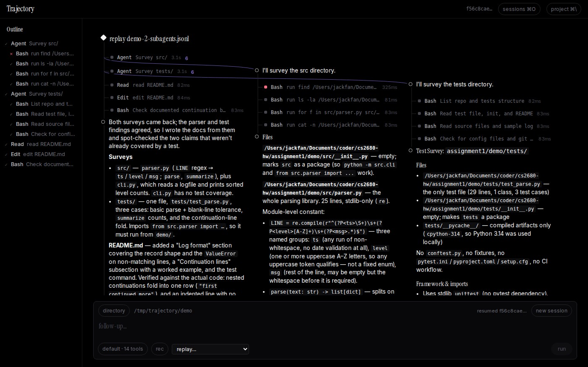

# Trajectory

A minimal black-and-serif console for driving Claude Code and watching each run as a tree, where parallel subagents branch off into their own lanes.



Created by Jack Fan.

## What it does

You type a request and pick a directory. Trajectory runs Claude Code headless (`claude -p --output-format stream-json`) and draws the run as it streams in. A twelve-step run fits on one screen, and you only open the steps you care about.

- **The run is a node-link tree.** Your prompt is the root. Each step below it is a single row: a status square, the tool name, a one-line description and a duration. Assistant text sits on hollow circle nodes. Each run ends on a summary node, e.g. `finished · $0.43 · 55.8s · 6 turns`.
- **Subagents get their own lanes.** When the agent starts parallel `Agent`/`Task` calls, each subagent branches off to the right along a curved connector. It runs as its own column of narration and tool calls, while the main line carries on straight down.
- **Timing pills.** While a call is running, its row counts up. Once a call has finished three or more times before, the pill also fills towards an estimate (`10.8s / ~27.0s`), taken from the median of those earlier durations. When the call returns, the pill settles into its real duration.
- **Cards instead of walls of JSON.** Click a node to open a card beside it. Inputs are laid out for each tool: a `Bash` command as a shell block, an `Edit` as a diff, a subagent brief as prose. Long results fold after 14 lines, and a `raw` toggle shows the literal payload.
- **Latency breakdown.** The summary node opens the run's cost, tokens, session id and `md`/`jsonl` export links. It also has a donut that splits the wall time into stages: queue, boot, api, agent, tools (per tool), stream and exit. Time-to-first-token is shown too.
- **Outline sidebar.** A table of contents for every turn, grouped by prompt, with subagent calls nested under their parent. Click an entry to jump to it.
- **A composer that holds every run setting.** It has:
  - a directory picker with recent folders, use counts and path validation;
  - model, effort and permission mode;
  - agent, max turns, per-tool toggles, MCP servers, skills and an extra system prompt;
  - `rec`, which saves a live run as a replayable recording;
  - `replay…`, which plays a recorded stream through the same renderer.

  Follow-up prompts resume the same Claude Code session.
- **Project panel (`Ctrl+\` / `⌘\`)** with four segments:
  - **files**: a file tree with an edit heatmap, each file with the agent's changed lines marked, and diffable snapshots of every edit;
  - **runs**: totals for the directory, latency mix, tool histogram and past runs;
  - **procs**: background processes the agent left running, which you can kill;
  - **config**: `CLAUDE.md`, `.claude/settings.json`, specs, and what Claude Code can see from this directory.
- **Sessions gallery** (the `sessions` button). It lists every conversation this app has run, plus the sessions in Claude Code's own local store (`~/.claude/projects`). Open one to load its whole tree and continue it.
- **Optional plain-English labels** from a small local model (see [below](#optional-plain-english-tool-call-labels)). Without one, rows use Claude's own descriptions or a readable heuristic.

## Requirements

- Node.js 20 or newer (with npm)
- Python 3.10 or newer (`uv` is used if it is installed, otherwise `python3 -m venv` + pip)
- For live runs only: the [Claude Code](https://docs.claude.com/en/docs/claude-code) CLI (`claude`) on `PATH`, already logged in. Replays need neither `claude` nor an account.

## Quick start

From a clone of this repository:

```bash
cd trajectory
./trajectory setup     # creates server/.venv and runs `npm ci` in client/
./trajectory dev       # web on 0.0.0.0:8000, API on 127.0.0.1:8001
```

Open http://localhost:8000 (or `http://<your-machine-ip>:8000` from another machine). The first page load takes a few seconds while the dev server compiles. Stop it with `Ctrl+C`.

The browser only ever talks to port 8000. The page's server forwards `/api/*`, including the live event streams, to the Python API, which listens on loopback only.

`./trajectory doctor` shows what is installed. `./trajectory help` lists every command.

## Try it without Claude (replay)

Three recorded runs are bundled in `server/fixtures/`. Replays go through the same parser as live runs, cost nothing and never start `claude`.

1. Start the app (`./trajectory dev`) and open http://localhost:8000.
2. In the composer at the bottom, click **directory**. Type the full path of this folder's `demo/` directory into the path box, for example `/path/to/trajectory/demo`, and click **open**. Then click the highlighted **use …/demo** button. The **replay…** menu stays disabled until a directory is set.
3. Pick **`demo-2-subagents.jsonl`** from **replay…**. The run streams in over a few seconds and ends on `finished · $0.43 · 55.8s · 6 turns`.
4. Then pick **`demo-3-tool-error.jsonl`**. It is added as a follow-up turn with a failed `Read` call.

The bundled recordings:

| File | What it shows |
|---|---|
| `demo-1-fix.jsonl` | The agent runs the failing test in `demo/`, fixes `src/parser.py` and re-runs the tests |
| `demo-2-subagents.jsonl` | Two parallel subagents survey `src/` and `tests/`, then the main agent updates `README.md` from their reports |
| `demo-3-tool-error.jsonl` | A short run in which a `Read` of a missing file fails |
| `events.jsonl`, `subagents.jsonl` | Earlier recordings of the same two tasks (bug fix, subagent survey) |

The recordings were made on the author's machine, so the paths inside them point there. A replay never changes files in the directory you picked.

## Things to try

- **Subagent lanes.** Replay `demo-2-subagents.jsonl` and watch the two `Agent` rows send curved connectors to their own lanes. Their pills count up, then settle into durations.
- **Cards.** Click any tool node to open its card. Try `raw` on an `Agent` or `Bash` call, and `N more lines` on a long result.
- **Latency.** Click the final `finished · …` node for the run details, the latency donut and the `md`/`jsonl` export links.
- **Failures.** Replay `demo-3-tool-error.jsonl` as a follow-up. The failed `Read` shows a red square, and the outline marks it with `×`.
- **Project panel.** Press `Ctrl+\` (`⌘\` on macOS) and switch between files, runs, procs and config. `Escape` closes it.
- **Sessions.** Open **sessions** in the header. Your replayed session is listed there, along with any sessions in your local Claude Code store.
- **Outline.** Click an entry in the left sidebar to jump to that call.
- **Start fresh.** Click **new session** in the composer to clear the tree.

## Live mode with Claude Code

1. Install Claude Code and log in (`claude` on `PATH`). Trajectory removes `ANTHROPIC_API_KEY` from the environment it gives `claude`, so runs use your stored Claude Code login.
2. Start the app and use **directory** to pick a scratch folder. The bundled `demo/` is a small Python log parser with one deliberately failing test. Some good prompts for it:
   - `One test in tests/test_parse.py fails. Run the tests, find the bug in src/parser.py, fix it.`
   - `Use two subagents in parallel to survey the code and the docs, then summarise the repo.`
3. Type the prompt and press `Ctrl+Enter` (`⌘↵`) or click **run**. Follow-ups resume the same session. **new session** starts over.

**Permissions: live runs default to `--dangerously-skip-permissions`.** Claude Code will edit files and run shell commands in the chosen directory without asking. Point it at a scratch directory or a copy of `demo/`, never at your home folder. You can change this before a run: open the options button left of **rec** (it reads `default · N tools`) and set **mode** to another permission mode (`--permission-mode`). Note that headless runs cannot answer permission prompts, so in a stricter mode any tool call that needs approval is denied.

After a replay, click **new session** before your first live prompt. A replay carries the recorded session id, and a follow-up would try to `--resume` a session that does not exist on your machine.

To record your own runs for replay, turn on **rec** before a live run. You can also use `./trajectory record <name> <dir> "<prompt>"`, which also uses `--dangerously-skip-permissions`. Either way, the raw stream is saved to `server/fixtures/<name>.jsonl`.

## Configuration

| Variable | Default | Meaning |
|---|---|---|
| `PORT` | `8000` | Port of the web server (the only port the browser needs) |
| `HOST` | `0.0.0.0` | Interface the web server binds to; use `127.0.0.1` to keep it local |
| `API_PORT` | `8001` | Internal port of the Python API, always bound to `127.0.0.1` (`PORT_API` is accepted as an alias) |
| `CLAUDE_BIN` | `claude` | Claude Code executable used for live runs |
| `TRAJECTORY_DATA` | `./data` | Where the SQLite database (runs, frames, snapshots, label cache) is kept |
| `INLINE_RESULT_CHARS` | `4000` | Tool output kept inline in the stream; the full text is always stored |
| `SUMMARIZER_URL` | `http://127.0.0.1:8088/v1/chat/completions` | OpenAI-compatible endpoint for tool-call labels |
| `SUMMARIZER_MODEL`, `SUMMARIZER_KEY`, `SUMMARIZER_TIMEOUT` | see `server/app/config.py` | Model name, API key (hosted endpoints only) and timeout for the labeller |
| `PYTHON` | `python3` | Interpreter `setup` uses to create `server/.venv` when `uv` is not installed |

For example: `PORT=8080 API_PORT=8081 ./trajectory dev`, or `HOST=127.0.0.1 ./trajectory dev`.

Launcher commands:

| Command | What it does |
|---|---|
| `./trajectory setup` | Install the Python env and client dependencies |
| `./trajectory dev` | Run in the browser with hot reload (web `:8000`, API `:8001`) |
| `./trajectory doctor` | Check prerequisites and what is installed |
| `./trajectory build` | Production build of the client (`client/.next`) |
| `./trajectory` | Optional desktop app (see below) |
| `./trajectory model` | Serve the optional local labelling model |
| `./trajectory record <name> <dir> "<prompt>"` | Record a live run as a replay fixture |
| `./trajectory clean` / `reset` | Remove builds and installed deps / also delete `data/` |

The npm scripts work too: `npm run dev` at the top level is the same as `./trajectory dev`, and `cd client && npm run typecheck` runs the TypeScript check.

### Optional: plain-English tool-call labels

A small local model can label each call ("install the pinned dependencies" instead of `npm ci --prefer-offline --no-audit`). With [llama.cpp](https://github.com/ggml-org/llama.cpp) installed (`llama-server` on `PATH`):

```bash
./trajectory model     # serves LiquidAI/LFM2.5-2.6B on :8088
```

The first run downloads about 1.7 GB of weights into `~/.cache/llama.cpp`. Any OpenAI-compatible endpoint works through `SUMMARIZER_URL`/`SUMMARIZER_MODEL`. Labels are cached in SQLite, so each distinct call is labelled once. Without a model, nothing breaks: rows use a heuristic label. `GET /api/health` reports whether the model is reachable.

### Optional: desktop app

`./trajectory` with no arguments installs Electron the first time (`npm install` at the top level, about 270 MB), builds the client and opens Trajectory in its own window. In this mode the API and web server run on free loopback ports chosen at launch, and closing the window stops both. It needs a desktop session. The browser version above does not need Electron.

## Security note

`./trajectory dev` listens on **0.0.0.0:8000**, so anyone who can reach that port can use the app. That includes browsing and editing files the server can access, and reading your local Claude Code sessions. In live mode it means starting Claude Code on your machine with permission checks skipped. On a shared or untrusted network, run it with `HOST=127.0.0.1 ./trajectory dev`. There is no authentication.

## Project layout

```
trajectory            launcher script (setup, dev, doctor, build, model, record, …)
client/               Next.js 15 + React 19 front end
  server.mjs          serves the app on PORT and forwards /api/* (incl. SSE) to the API
  app/, components/, lib/
server/               FastAPI back end (spawns `claude`, parses the stream, stores runs in SQLite)
  fixtures/           recorded runs for replay
demo/                 small Python project used as the agent's playground
electron/             optional desktop shell
scripts/              setup / run / build / record helpers used by the launcher and npm scripts
data/                 runtime database (created on first run, git-ignored)
```

## Known limitations

- Estimate pills (`elapsed / ~estimate`) need at least three earlier live runs of the same call. In replays, rows count up and then show their durations.
- Don't run `./trajectory build` while `./trajectory dev` is running: both write `client/.next`.
- Replays use synthetic wall-clock phases. The latency panel says so, and the cost, turns and API time come from the recording.
- Cloud-hosted Claude Code sessions are not in the local store, so the sessions gallery cannot list them.
